# A Cloud Guru Notes: AWS Certified Cloud Practitioner Course

**Author:** Richard Hanna

The purpose of this document is to consolidate and highlight key notes from the lessons and labs in the [**AWS Certified Cloud Practitioner**](https://acloudguru.com/course/aws-certified-cloud-practitioner-clf-c01) Course on A Cloud Guru.

This markdown is broken down by chapters in the course, with subsections based on the lectures and labs.

This is an admittedly scrawled series of notes, so please excuse any typos :sweat_smile:

**Symbol Key:**

- :bulb: = AWS exam likelihood

## Cloud Concepts & Technology

:bulb: There are several key advantages of cloud computing:

1) Trade **capital expense** for **variable expense** (pay for only what you use)
2) Benefit from massive economics of sale, i.e. you as an individual or business have the same purchasing power as Amazon
3) No need to guess about the capacity you need, you can scale with your business needs
   1) You can even have auto-scaling in line with demand
4) Increase speed and agility
   1) You can be up and running with cloud computing extremely quickly compared to when you used to have to contract businesses to set up physical servers for you
5) Stop spending money on building and running data centers
6) Go global in minutes
   1) Leverage availability zone and regional power to cater to audiences globally

**There are 3 types of cloud computing:** :bulb:

1) Infrastructure as a Service (**IAAS**)
   1) You manage the server (private or virtual), example: EC2
2) Platform as a Service (**PAAS**)
   1) Ex: GoDaddy and Elastic Beanstalk, no management of underlying hardware
3) Software as a Service (**SAAS**)
   1) Ex: GMail. You manage the software like the email inbox, everything else taken care of by Google

**There are 3 Types of Cloud Computing Deployments:** :bulb:

1) **Public Cloud** - Examples: AWS, Azure, GCP
2) **Hybrid** - A combination of public and private
3) **Private Cloud** - You manage the system. Examples: openstack or Vmware

While there are many services available on the management console, the AWS High Level Services / Global Infrastructure included for this exam are:

- Compute
  - EC2
  - Lambda
- Storage
  - Simple Storage Service (S3)
  - Glacier
- Databases
  - RDS (relational database service)
  - Dynamo DB (non relational)
- Migration & Transfer
- Network & Content Delivery
  - VPC
  - Route 53 (DNC service)
- Security, Identity & Compliance
- AWS Cost Management

## Around the world with AWS

AWS Global Infrastructure:

There are **19 regions & 57 availability zones**.

- **Regions**: A geographical region (us-east-1 i.e. N. Virginia) with 2+ availability zones
- **Availability Zones**: A Data center. Big building filled with servers. Could be multiple so an event doesnt take the whole zone offline. _There are always more AZ's than regions._
- **Edge Locations**: end points for AWS caching content. Ex: download a file from New York that can be retrieved from a cacheing server in London _There are always more edge locations than AZ's (and by proxy, regions)._

:bulb: **Choosing the right AWS region**:

- Data Sovereignty Laws (i.e. Brexit, HIPPA, anything that impacts legality of the data)
- Latency to end users (i.e. user physical location, N. Virginia server for us)
- AWS services (i.e. east service gets things first so singapore might get a service later)

:bulb: **AWS has 4 Different Support Plans**:

1) Basic
   1) Only recieves service for billing and access questions in the AWS community forums
   2) Free
2) Developer
   1) One primary contact may ask technical questions and get a response in 12-24 hours
   2) $29/month (scales based on usage)
3) Business
   1) 24x7 support and chat, 1 hour response time for urgent cases
   2) $100/month (scales based on usage)
4) Enterprise
   1) Recieves an assigned Technical Account Manager (TAM), 15min response to critical cases
   2) $15,000/month (scales based on usage)

## :bulb: Billing Alarm Set Up

Know how to get auto-notified if your account goes over X amount of dollars. In this lesson we set up a billing alarm to notify us if we go over $10.

- Go to _CloudWatch_
  - Set up an alarm
  - Create a rule that says you want to be notified via "Create Topic" and using an "SNS Topic" when your bill goes over $10

## Identity Access Management (IAM)

:bulb: Know that IAM is a _global_ AWS service!

**MFA Setup**, which is always recommended, can be done using the Google Authenticator app for mobile.

**Note**: The current lab is a touch out of sync with the current AWS layout. To access multi-factor authentication you go to IAM dashboard then click "My Access Key" under "Quick Links" to the right (shown below):

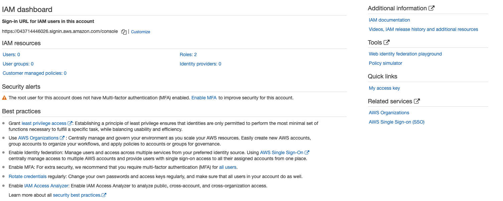

To set up MFA, use a smartphone to download the Google Authenticator app and activate a "Virtual MFA device" (the other options are "U2F security key"  and "Other hardware MFA device").

**IAM User Creation:**

:bulb: When setting up an IAM user, know that there are **3 ways to access AWS**:

1) Programmatic Access (access key ID & secret access key)
2) AWS Management Console
3) Amazon SDK

IAM User policies are _always_ written in **JSON** format.

**IAM Password Policy:**

Note: Unlike the video online, to access the IAM password policy you must go to "Account settings" under "Access Management" as shown below:

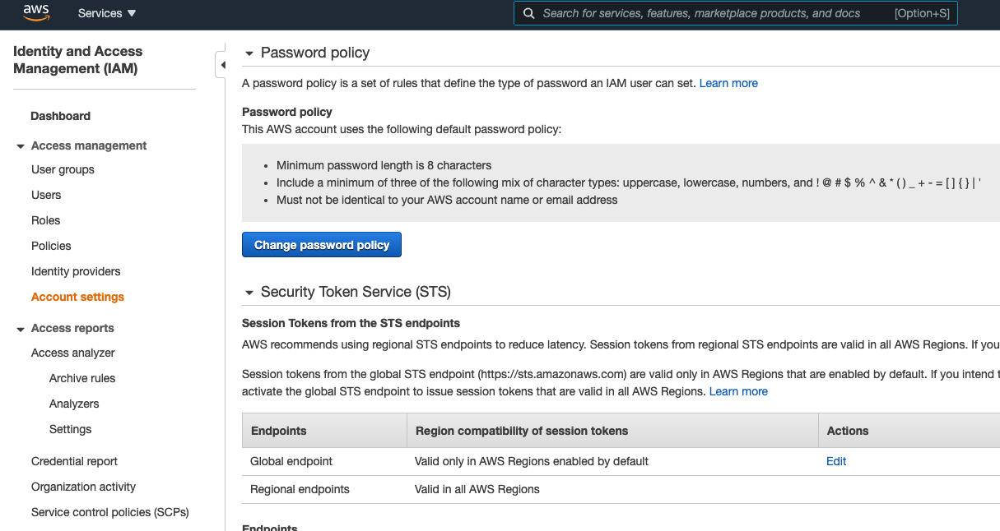

:bulb: **Exam Tips**:

- IAM = "Identity access management" and it is a global service, a region specification is not required.
- 3 different ways to access AWS (see above)
- The root account is the email address used to set up the account, and you should always set up MFA for this account and keep it secure
  - You should create an admin account to access and not use the root account
- Groups are a place to store users, users will inherit all permissions of that group.
  - Always try to apply policies to groups and not individual users
- To give permissions to a group you need to apply a policy, given via JSON and a **key value pair** such as `{"name": "A Cloud Guru}`
- IAM Credential Reports are used to audit the permissions of users and accounts. This shows all the users and the specifications, permissions, etc. applied to them in CSV format. These are available as shown below:

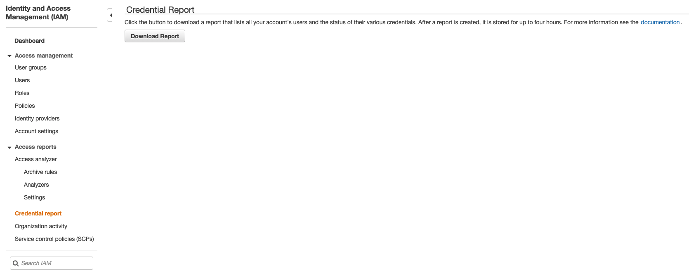

## S3 101

"S3" stands for "simple storage service" and is AWS's oldest service. It provides secure, highly-scalable and durable storage objects. Basically a storage device, specifically "object-based storage" from 0bytes to 5terabytes.

"Bucket" = folder.

:bulb: S3 is a universal namespace, i.e. names must be globally unique.

**"Objects" consist of:**

- **Key**: the name of the object
- **Value**: the actual data in a sequence of bytes
- Version ID: for versioning the item
- Metadata: data about the data being stored
- Subresources: Access control lists, torrent

:bulb: Remember that S3 objects are **key-value pairs**.

:bulb: **How does data consistency work for S3?**

- Read after Write consistency for PUTS of new objects
  - You will be able to immediately view new files/data
- Eventual Consistency for overwrite PUTS and DELETES (can take some time to propogate)
  - Updating existing files or deleting a file and immediately reading it means you may get an older version or you may not. Changes to objects can take a little more time to propgate.

**S3 Features:**

- Tiered storage
- Lifecycle Management
- Versioning
- Encryption
- Secure your data using **Access Control Lists** and **Bucket Policies**

**S3 Storage Classes:**

There are 7:

1) S3 standard
2) S3 - IA ("Infrequently Accessed")
   1) Lower fee but charge for a retrieval fee, data needs to be immediately available
3) S3 One Zone - IA
   1) Lower cost option, infrequent access but does not require multiple availability zones
4) S3 Intelligent Tiering
   1) Optimize costs by auto moving data to most cost effective access tier by analyzing usage patterns
5) S3 Glacier
   1) Low cost data archiving, retrieval times from minutes to hours
6) S3 Glacier Deep Archive
   1) Retrieval time of 12 hours is acceptable, lowest cost storage class
7) S3 Outposts
   1) Object storage to on-premises AWS Outpost environments

S3 charges based on storage, requests, management pricing, data transfer pricing, transfer acceleration and cross region replication pricing.

Transfer acceleration = fast transfer of files over long distances. Users upload a file to a bucket nearest to them and then the file is transfered over Amazon's internal network (not the internet).

Cross region replication is replication of a file in one bucket over in another bucket.

:bulb: **Exam Tips**:

- S3 is Object based, i.e. file uploads
  - Not suitable to install an OS on
- Files can be 0bytes to 5Tb
- There is unlimited storage
- Files are stored in buckets
- S3 is a universal namespace
- S3 buckets have URLs following the format: `https://s3-eu-west-1.amazonaws.com/acloudguru`
- Successful uploads generate a HTTP 200 status code
- Key fundamentals:
  - Key-value pair
  - Read after write consistency for PUTS of new objects
  - Eventual consistency for overwtie PUTS and DELETES (takes time to propagate)
- 7 different storage classes (see above)
  - Know which ones have shorter retrieval times and which have longer ones (like Glacier)

### Hands on with S3 Bucket

To create a bucket permission policy and change the access of all contents of the bucket, go to Permissions -> Bucket policy and enter the JSON text to control the policy. This can be helpful so you dont have to change the permissions on each individual file. Otherwise selecting the proper things from the "Actions" tab will suffice.

Only static files can be hosted as S3 bucket websites, non static things like WordPress cannot. For this you need an EC2 instance.

### S3 Versioning

Under properties you can access "Bucket Versioning", once enabled you can only suspend versioning and it cannot be deleted. Once you upload a new version of an existing file you will be able to see different versions of files under "Objects" >> "List Versions".

**Exam Tips:**

:bulb: S3 Versioning stores all versions of an object and cannot be disabled, only suspended. Great backup tool and integrates with lifecycle rules. Versioning can also be used with MFA delete capability.

### CloudFront

Amazon's content delivery network (CDN) which delivers web pages based on user's location.

**Key Terms:**

- Edge Location: Location where content is cached (different from AWS Region/AZ)
  - Not just read only, can also be written to
- Origin: Where the origin of the files are that the CDN will distribute (S3, EC2, ELB, Route 53)
  - Basically a query for some data will be taken from the origin and then cached at an edge location for future easier retrieval
- Distribution: Name for CDN which consists of edge locations
  - 2 Types of Distributions
    - Web distribution for websites
    - RTMP for media streaming

CloudFront can be found under "Networking & Delivery". Note that setting up a CloudFront distrubtion can take approximately a half an hour. Cached objects are given a TTL i.e. **Time to Live**.

### EC2 101: Elastic Compute Cloud

EC2 is a virtual server/servers in the cloud. They are instantly available and have scalable server access.

:bulb: EC2 pricing models:

1) **On Demand**: fixed rate buy hour or second with no commitment
2) **Reserved**: Contract with a discount but with a 1 or 3 year service contract. Available in standard, convertible, or scheduled reserve instances.
   1) Know that Reserved instances are economic and come with a contract, the more and longer you use them the greater your savings.
3) **Spot**: Enables you to bid whatever price you want to pay for insance capacity and flexibility.
4) **Dedicated Hosts**: Physical EC2 server dedicated to you.

**EC2 Instance Type Mnemonic:**

Using the images below: "**FIGHT DR. MCPXZ** in **AU**stralia"

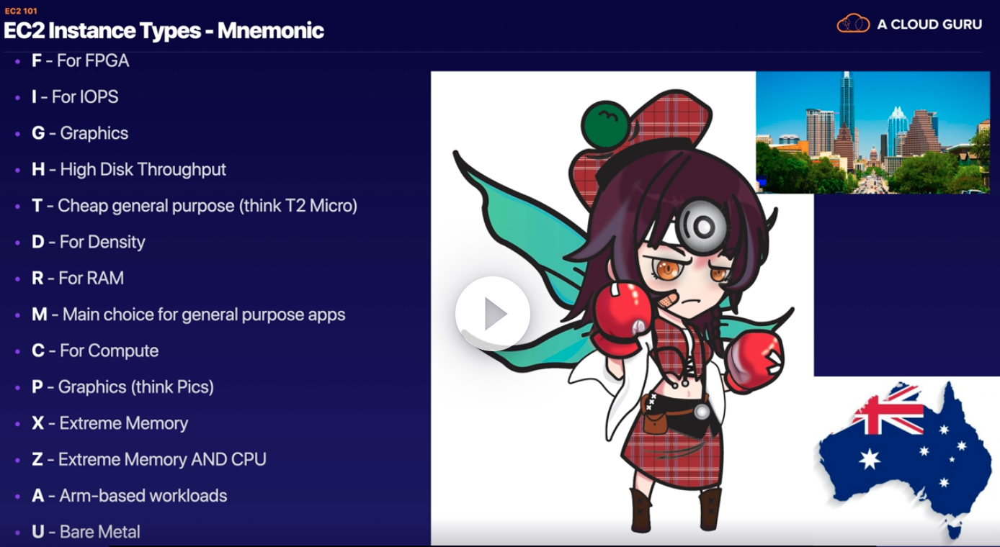

**What is EBS (Elastic Block Storage)?**

A virtual disk in the cloud that creates storage volumes attached to EC2 instances. It comes in two different types:

- SSD
  - General Purpose SSD (GP2)
  - Provisional IOPS SSD (IO1)
- Magnetic
  - Throughput Optimized HDD (ST1)
  - Cold HDD (SC1)
  - Magnetic (previous generation)

:bulb: **Exam Tips:**

- Know the different EC2 pricing structures
- If a Spot instance is terminated by EC2, you will not be charged for a partial hour of usage. However, if you terminate the instance yourself, you will be charged for any hour in which the instance ran.
- Instance type Mnemonic (FIGHT DR MCPXY in AU)
- EBS volume types (the 5 relevant ones)

Notes from EC2 101 Lab:

- How computers communicate
  - Linux = SSH (port 22)
  - Microsoft = Remote Desktop Protocol (port 3389)
  - HTTP = port 80
  - HTTPS = port 443
- To let everything in you use the CIDR address, IP 0.0.0.0/0
  - To let just one IP you use X.X.X.X/32 (where X is a specific IP)

You can create multiple VPC (virtual private clouds) from the VPC management console. In there you can create subnets for establishing private and puclic subnets. This requires creation of an internet gateway and routing the subnets to it, and attaching the route to the VPC.

### AWS CLI Tutorial

In the tutorial, the instructor uses an AWS OS (one of the advantages being the AWS CLI and associated packages are pre-installed). You can still use an Ubuntu instance by updating the Ubuntu system (`sudo apt update`) and then installing the AWS CLI (`sudo apt-get install awscli`).

You can then attempt to programatically make an S3 bucket using `aws s3 mb s3://acloudguru2019-ccp` but this will fail without credentials. Supply the credentials using `aws configure`. Supply the AWS Access Key and Secret Access key of your user. Use `us-east-1` for your region default (not 1a).

If we create an example txt file with "hello" it can then be uploaded to the bucket using:

```bash
aws s3 cp hello.txt s3://richardhannabucket

# Output
upload: ./hello.txt to s3://richardhannabucket/hello.txt
```

And sure enough if you go to the AWS Management Console you can see the bucket as well as the hello.txt file.

:bulb: **Exam Tips**:

3 ways to interact with AWS:

1) Using the console
2) Using the CLI
3) Using SDKs

### AWS Roles

To create a role you go to IAM and create roles there, then jump back to EC2, select your instance, and (unlike in the lecture) drop down Actions > Security > "Modify IAM Role".

To address security concerns over storying access keys in the .aws folder (via `aws configure`), it is much better practice to assign a role with particular rights to the instance instead that no longer relies on keys.

:bulb: **Exam Tips:**

- Roles are much more secure than access key ids and easier to manage
- Roles can be applied to EC2 instances at any time and immediately take effect
- Roles are universal and region agnostic

### Let's Use A Load Balancer

:bulb: **Exam Tips:**

- Load balancers have 3 different types: Application, Network, and IP.
  - Application makes intelligent decisions
  - Network has extreme performance and static IP addresses

### Databases 101

AWS RDS come in 6 different versions:

1) SQL Server (Microsoft)
2) Oracle
3) MySQL
4) PostgreSQL
5) Amazon Aurora
6) MariaDB

RDS has 2 key features:

- Multi AZ for disaster recovery
- Read replicas for performance (up to 5 copies)

Non-RDSs are set up as follows:

- Collection = Table
- Document = Row
- Key Value Pairs = Fields

Example Amazon verison: Dynamo DB

Example:

```JSON
{
"id": "doejohn",
"firstname": "John",
"lastname": "Doe"
}
```

Columns can vary and not affect other rows in the database.

Two types of processing in terms of executed queries:

1) Online Transaction Processing (OLTP):
   1) Order 2120121 pulls up a row of data like name, date, address, etc
2) Online Analytics Processing (OLAP)
   1) Net profit for EMEA and pacific for digital radio product -> Pulls a large number of records, sums up radios sold, unit cost per region, and aggregates

The second example is a use case for **data warehousing**. Amazon's data warehouse is called "Redshift".

**What is Elasticache?**

AWS web service that simplifies deployment, operation, and scaling of in memory cache in the cloud. Improves performance o fweb apps for info retrieval instead of relying on slower disk-based databases.

> Example: Instead of having a query for every Amazon shopper looking for the top 10 kitchen items, Elasticache saves this information in its servers for a faster return result. Cache's most common queries, while uncommon queries still query the databases.

Elasticache has 2 open-source in-memory caching engines:

1) Memcached
2) Redis

:bulb: **Exam Tips:**

1) Types of RDS (6)
2) Dynamo DB (No SQL)
3) RedShift OLAP
4) Elasticache
   1) Memcached
   2) Redis
5) Redshift for database speed up, elasticache for speed up performance of existing databases (frequent identical queries)

### Let's Provision an RDS Instance

- The MySQL port is port 3306

This is the bootstrap script used to set up the DB on EC2 (note we are using the Amazon EC2 OS):

```bash
#!/bin/bash
yum install httpd php php-mysql -y
amazon-linux-extras install -y php7.2
cd /var/www/html
wget https://wordpress.org/wordpress-5.4.1.tar.gz
tar -xzf wordpress-5.4.1.tar.gz
cp -r wordpress/* /var/www/html/
rm -rf wordpress
rm -rf wordpress-5.4.1.tar.gz
chmod -R 755 wp-content
chown -R apache:apache wp-content
service httpd start
chkconfig httpd on
```

**Note:** this does not work when using a CHOP laptop, confirm IP browser viewing on mobile or elsewhere

Steps taken in this lab:

1) Provision an RDS instance
2) Open a MySQL Port to Web-DMZ Security Group
3) Create an EC2 instance
4) Install Wordpress Using a Boot Strap Script
5) Register the EC2 to the target group
6) Updated Wordpress to the DNS name of the load balancer we created (ALB)
7) Took a snapshot of the EC2 instance by creating an Image stored under AMI

:bulb: Exam Tips:

- RDS has 2 key features (MultiAZ and Read Replicas)
- Types of DBs

### Let's Look at Auto-Scaling

Using the amazon machine image (AMI) we will deploy 2 EC2 instances across 2 AZs.

First you must go to "Launch Configuration" and then after you can do "Auto Scaling Groups". Once you launch your config (you can use the previously made security group and also tie the config to the existing AMI), you can then select it from the list and select "Configure Auto Scaling Group". During the process of set up, tie the scaling group to the previously made load balancer.

The end result is that even though we terminated the original wordpress EC2 instance, on defining the luanch config and auto scaling group, we now have a fault-tolerant web page that will auto spin-up an EC2 instance to resume hosting.

### Let's Register a Domain Name

"DNS" = Domain Name System, basically a computer phone book for resolving domain names against IP Addresses.

First we will go to Route 53 where there are 4 options:

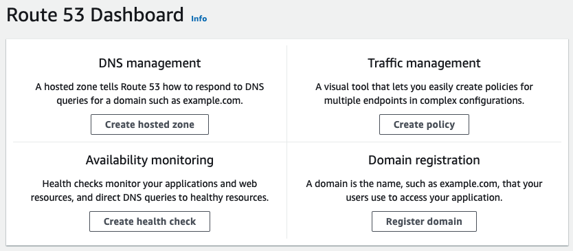

> I decided not to do this because the registration would cost $12

It is recommended to have an equivalently named S3 bucket to tie to the domain name. Note that domain registration can take a few hours to up to 3 days (rare).

:bulb: **Exam Tips**:

- Amnazon's DNS is called Route 53
  - Route 53 is global, similar to IAM and S3
  - You can use it to direct traffic all around the world and register a domain name

### Elastic Beanstalk

ELB basically speedlines all the things we have done manually in a streamlined automatic way. Essentially deploys apps to the cloud with very minimal domain knowledge.

:bulb: Exam Question: Name all of the compute services/select all of the ones in the management console.

### CloudFormation

Turns infrastructure into code. CloudFormation consists of "stacks" which, in this case, can contain an EC2 instance and an RDS instance and outputs a URL to connect into an AWS environment. In the example here CloudFormation uses a template to provision the EC2 and establish a wordpress server.

:bulb: **Exam Tips:**

CloudFormation is a service that sets up AWS resources. Templates can be invoked to create things like EC2 and RDS DB instances and AWS CloudFormation takes cre of provisioning and configuring those for you. It will automatically take care of indivudal creation and configuration and determination of what's dependent on what. Both CloudFormation and Elastic Beanstalk are free but the resources they provision, like EC2, are not. ELB is limited in what it can provision and is not programmable whereas CF can provision almost any service and is completely programmable.

### Architecting For The Cloud - Best Practices

All of the notes in this lecture reference [**this white paper**](https://d1.awsstatic.com/whitepapers/aws-overview.pdf).

Traditional vs Cloud Computing:

- IT Assets as Provisioned Resources
  - You dont have to wait for physically created or contracted set ups
- Global, Available, and Scaleable Capacity
  - AZs and regions allow for anytime anywhere use
- Higher level managed services
- Built-In security
  - AWS is more secure than doing things on prem
- Architecting for cost
  - You can build out your infrastructre to the cost you desire
- Operations on AWS
  - Migrate virtual machines into AWS EC2s and RDSs, i.e. refactoring and re-architecting for serverless architecture

Design Principles:

1) Scalability
   1) Scale Up: Increase amount of RAM or CPU in one machine
   2) Scale Out: Add multiple machines using elastic load balancers
      1) Stateless Applications, think about how lambda allows Alexa to execute queries without retaining them after delivering a result
      2) Distribute load to multiple nodes
         1) Example: Replicates
      3) Stateless Components
         1) Example: When youre signed into a website you have personalized login details stored into a users browser as a cookie.
      4) Stateful Components
         1) Example: Keep the cookie on and store the data about the users behavior in a database like an RDS
      5) Implment Session Affinity
         1) Cookie is placed in a users browser an application load balancer will detect the cookie and send them to the same EC2 instance as before
      6) Implment Distributed Processing
2) Disposable Resources Instead of Fixed Services
   1) I.e. being able to terminate EC2 instances with flexibility
   2) Instantiating Compute Resources
      1) Boostrapping
      2) Golden Images (like what we set up with the AMI)
      3) Containers
      4) Hybrid (combination containers & EC2)
3) Infrastructure as code
   1) CloudFromation
4) Automation
   1) Serverless Management and Deployment
   2) Infrastructure Management and Deployment
      1) Example AWS Elastic Beanstalk, Amazon EC2 Auto recovery
   3) Alarms and Events
      1) Cloudwatch alarms and events
5) Loose Coupling
   1) See lecture
6) Services Not Servers
7) Databases
   1) Relational Databases (Aurora)
      1) Scalability, high availability
      2) Anti-patterns: No need for joins
   2) Non-relational databases (Dynamo DB)
      1) Scalability, high availability
      2) Anti pattern: are need for joins, large files like videos
   3) Data Warehouse (Redshift)
      1) Anti-pattern: online transaction processing
   4) Search
      1) CloudSearch and ElastiSearch
   5) Graph Databases
      1) Amazon Neptune :bulb:
8) Managing Increasing Volumes of Data
   1) Advice: For massive amounts of data a data lake is encouraged in S3
9) Removing single points of failure
   1) Introduce redundancy
   2) Detect Failure
   3) Have durable data storage
   4) Auto multi-data center resilience
   5) Fault isolation and traditional horizontal scaling (scaling out instead of up)
   6) Sharding (splitting data across multiple shards)
10) Optimize for cost
    1) Right sizing
    2) Elasticity
    3) Take advantage of the purchasing options
11) Caching
    1) Application caching
    2) Edge Caching
12) Security

### Global AWS Services

:bulb: Which services are global?

- IAM
- Route53
- CloudFront
- SNS
- SES

S3 gives global views but is regional.

### What AWS Services can be used on Premise?

:bulb:

- Snowball
  - Basically a disk that is shipped to you, you load things on it, then ship it back to Amazon
  - Faster to upload large amount of data than over the web
- Snowball Edge
  - Similar to snowball but with ability to deploy Lambda functions on prem. Boeing used this to test aircraft. Used where you can't get AWS Connectivity like the Arctic...?
- Storage Gateway
  - Similar to snowball but it stays on prem at all times. Way of caching files inside prem and replicates files to S3.
- CodeDeploy
  - Deploy code to EC2 as well as on prem servers
- Opsworks
  - Similar to beanstalk. Uses Chef which helps with automated deployments either to EC2 or on prem servers
- IOT Greengrass
  - IOT for AWS cloud and on prem services
  
### CloudWatch 101

:bulb: Know what CloudWatch is!

- Monitor AWS resources and applications, analogy is a personal trainer monitoring your performance
- Cloudwatch can monitor:
  - Compute
    - EC2, autoscale groups, ELBs, Route53
  - Storagte & Content Delivery
    - EBS volumes, storage gateways, CloudFront
- Host level metrics consist of:
  - CPU, network, disk, status checks

### AWS Systems Manager

AWS Systems Manager allows you to monitor EC2 instances _at scale_. Multiple EC2 instances = "EC2 fleet". The systems manager deploys software on each EC2 instance so a command can be run across the fleet.

:bulb: Know what this is: manages fleets of EC2 instances by installing software on each machine so patches, installations, etc across a fleet and that the manager integrates with CloudWatch to give a dashboard of entire estate.

### :bulb: Service Health Dashboard

1) Overview of all regions
   1) Health of regions
2) Daily Historical Info
3) RSS feeds

Basically know that if there's an outage you can go to this dashboard to locate the problem.

### :bulb: Personal Health Dashboard

Personalized to your health services with relevant usable info.

What to know: difference between service and personal health dashboards.

### :bulb: S3 vs EBS vs EFS

These are the 3 different storage options, know the difference and what to use when.

**S3:**

- Safe place to store flat files
- Object-based
- Data spread across multiple devices and facilities

**EBS (Elastic Block Store):**

- Persistent block storage volumes
- Better for storing operating systems and databases, not object files
- Auto-replicated to protect from component failure
- Think of as a virtual hard disk in the cloud, size can be changed but it is not done automatically

**EFS (Elastic File System):**

- File storage service for EC2
- Like with EBS is a virtual disk in the cloud
- Can install databases similar to EBS', but will auto grow to handle growing databases unlike EBS

### :bulb: Global Accelerator

Create accelerators and direct traffic over the AWS global network to improve application performance. Basically know that the way to increase reliability and consistency when the internet is congested, you turn to the AWS Global Accelerator.

## Billing & Pricing

### How AWS Pricing Works

The notes from this lecture reference the [**AWS white paper here**](https://docs.aws.amazon.com/whitepapers/latest/how-aws-pricing-works/welcome.html).

**Capex v Opex:**

- Capex = "Capital Expenditure" i.e. fixed sunk cost paid up front
- Opex = "Operational Expenditure" i.e. you pay for what you use, similar to utlity bills

**5 Basic Pricing Policies:**

1) Pay as you go
2) Pay less when you reserve
3) Pay even less per unit by using more
4) Pay even less as AWS grows
5) Custom pricing

**Best Practices:**

1) Understand the fundamentals of pricing
   1) Compute
   2) Storage
   3) Data Outbound (data leaving your AWS)
2) Start early with cost optimization
   1) Basic concept is unlike early days where you would purchase up front, pricing now is continuous and variable based on need. So it pays to efficiently plan and optimize architecture early on before enviroments become large and complex.
3) Maximize the power of flexibility
   1) AWS products are priced for exactly what you use. No minimum commitments and equips business with the ability to be fully elastic. You dont pay for resources when they arent running. By turning off resources you aren't using instead of leaving them running always, you can save 70% of the cost.
4) Use the right pricing model for the job
   1) On demand
   2) Dedicated instances
   3) Spot instances
   4) Reservations

**What are "free services"?**

- Amazon VPC
- Elastic beanstalk (but not the resources it provisions)
- Cloud Formation (but not the resources it provisions)
- IAM
- Auto scaling (not the provisioned instances)
- Opsworks
- Consolidated Billing

**What determines price?**

- **EC2**
  - Clock hours of server time
  - Instance type
  - Pricing Model
    - On demand
    - Reserved
      - Reserve capacity and recieve a discount on instance usage compared to on demand. The more you pay up front and the longer you run the contract the more you save.
    - Spot
    - Dedicated
  - Number of Instances
  - Load Balancing
  - Detailed Monitoring
  - Auto Scaling
  - Elastic IP Addresses
  - Operating Systems and Software Packages
- **Lambda**
  - Request pricing
    - free tier: 1million requests per month
    - $0.20 per 1 million requests thereafter
  - Duration Pricing
    - 400,000 GB seconds free and up to 3.2 million seconds of compute time. Then minimal charge per GB-second used thereafter
  - Additional charges if lambda functions transfer data to other AWS sources like S3
- **EBS**
  - Volumes per GB
  - Sanpshots per GB
  - Data Transfer
- **S3**
  - Storage Class (FIGHTDRMCPXYAU)
  - Storage
  - Requests (GET, PUT, COPY)
  - Data Transfer
- **Glacier**
  - Storage
  - Data Retreival times (longer the time the greater the savings)
- **Snowball**
  - Service fee per job
  - Snowball 50TB is $200
  - 80TB is $250
  - Daily charge after first 10 days of $15
  - Data transfer in to S3 is free, data transfer out is not
- **RDS**
  - Clock Hours of server time
  - Database characteristics
  - database purchase type
  - number of db instances
  - provisioned storage
  - Additional storage
  - Requests
  - Deployment type
  - Data transfers
- **DynamoDB**
  - write data, read data, indexed data storage
- **CloudFront**
  - Traffic distribution
  - Requests
  - Data Transfer Out

### AWS Budgets vs AWS Cost Explorer

**AWS Budgets:**

- Set custom budgets that alert you when your costs exceed, or are forecasted to exceed, a budgeted amount
  - Budget costs _before_ they have incurred

**AWS Cost Explorer:**

- Visualize and manage costs _after_ they have incurrred

**AWS Support Plans:**

- Basic
- Developer
- Business
- Enterprise

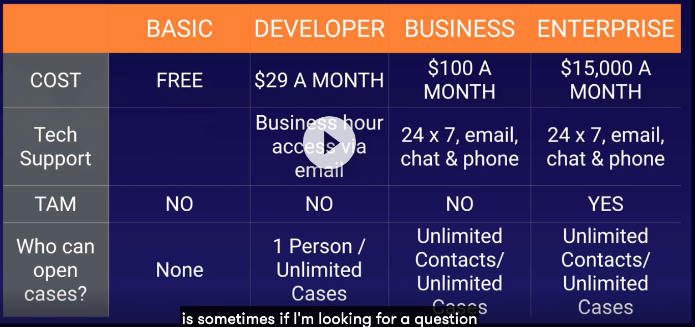

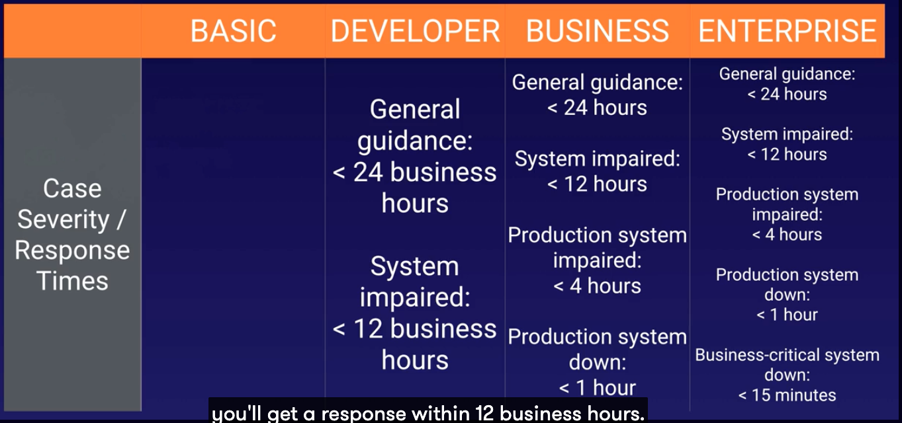

### Tagging & Resource Groups

What are tags?

- Key value pairs attached to AWS resources
- Metadata
- Tags can sometimes be inherited

Resource groups make it easy to group resources based on tags. Resource groups contain info such as:

- Region
- Name
- Employee ID
- Department

Resource groups make it easy to group and execute tasks on groups that share one or more tags. Example was stopping all EC2 instances in a specific region.

Remember that Tag editor is a global service while resource groups are regional.

### AWS Organizations & Consolidate Billing

What is AWS Organizations?

- An account management service to consolidate multiple AWS accounts. Two feature sets: consolidated billing, all features.

The consolidated paying account can see the bills accrued by the linked accounts (example: production team, testing team, bank office), but cannot actually go in and change any resources like EC2 instances within those accounts.

**What is CloudTrail?**

Where CloudWatch monitors performance, CloudTrail monitors API calls in the AWS platform for auditing (creating EC2, new users, S3 calls, etc). CloudTrail also allows for unused reserved instances of EC2 to be applied across the group.

CloudTrail is per account and enabled per region. Logs can be consolidated into an S3 bucket by turning on CloudTrail in the paying account and creating a bucket policy that allows cross-account access. Turn CloudTrail on in the other accounts and use the bucket in the apying account.

### AWS Quick Starts & Landing Zones

The [**quick starts page**](https://aws.amazon.com/quickstart/?solutions-all.sort-by=item.additionalFields.sortDate&solutions-all.sort-order=desc&awsf.filter-tech-category=*all&awsf.filter-industry=*all&awsf.filter-content-type=*all) offers many quick start solutions for getting up and running with different technologies offered by various companies. Ex: Click on Microsoft Exchange to be immediately taken to CloudFormation and make an email server! Quick start is great for povisioning one technology into one AWS account

The [**AWS Landing Zone**](https://aws.amazon.com/solutions/implementations/aws-landing-zone/), on the other hand, allows for set up multi-account AWS environments. Great for automating multiple account setups.

### AWS Partner Network

2 Types of Partners:

1) Consulting
2) Technology

Requirements for businesses to become partners involve employees filling out the following:

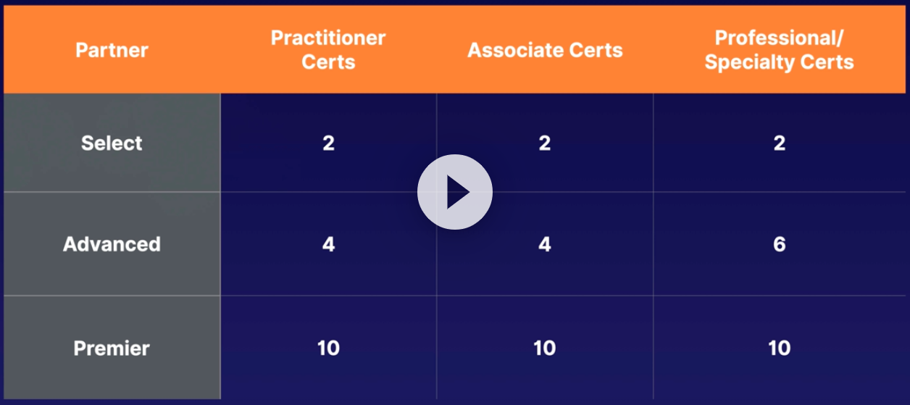

### :bulb: AWS Calculators

2 calculators are available:

1) [**AWS Simple Monthly Calculator**](https://calculator.s3.amazonaws.com/index.html)
   1) Ex: I have X amount of EC2 instances with Y specs running for Z time, how much will this cost me monthly?
2) [**AWS Total Cost of Ownership Calculator**](https://calculator.aws/#/)
   1) Ex: What is the total cost of having your products on prem versus in the cloud?
   2) Creates reports to show finance teams and drive business decisions

## Security in the Cloud

### Compliance on AWS & AWS Artifact

To verify how and why AWS is compliant with various organizations (like HIPPA) you can check out their resources and white paper on the [**AWS Compliance site**](https://aws.amazon.com/compliance/?nc=sn&loc=3) and a list of their [**compliance programs**](https://aws.amazon.com/compliance/programs/) (including HIPPA).

You can also find all of these within the management console under "AWS Artifact" and get the "artifact" tied with that compliance report.

### :bulb: AWS Shared Responsibility Model

AWS manages security of the cloud, but the security of what is placed _in_ the cloud lies in the hands of the customer. You maintain and retain control of what security will be implemented and it is your responsibility to protect your content, platform, apps, etc. 

Here's an example. Amazon is responsible for maintaining the data centers where servers are physically located, but you as a customer are responsible for keeping your EC2 instances updated. If an EC2 instance is hacked because you didn't update it, that's on you.


- AWS = "Security _of_ the cloud"
- Customer = "Security _in_ the cloud"

All notes about this can be found on the [**AWS Shared Responsibility Model page**](https://aws.amazon.com/compliance/shared-responsibility-model/).

> This section can be 4-5 questions on the exam, so knowing the diagram and visualizing who's responsibility is what will help.

### AWS WAF (Web Application Firewall) & AWS Shield

AWS WAF is a firewall that protects web apps from common exploits. For example, the firewall will monitor traffic and stop cross-site scripting or SQL injections at the application before they make it to the databases or load balancers. 

AWS Shield is a managed Distrbuted Denial of Service (DDoS) protection service safeguarding web apps on AWS. Basically this will stop DDoS attacks, i.e. when a hacker sends more traffic to your site than your site can handle causing a crash.

There are two AWS Shield tiers: 

- AWS Shield
  - Comes with all new accounts
- AWS Advanced
  - This tier will reimburse the attacks
  - $3,000 a month

### AWS Inspector vs AWS Trusted Advisor vs AWS CloudTrail

**What is AWS Inspector?**

Auto security assessment service that helps improve security and compliance of apps deployed on AWS. Auto assesses apps for vulnerabilitiesand produces a list of findings by level of severity. Findings can be reviewed directly or as part of detailed assessment reports available via the Inspector console or API. The inspector gets installed on your EC2 instances.

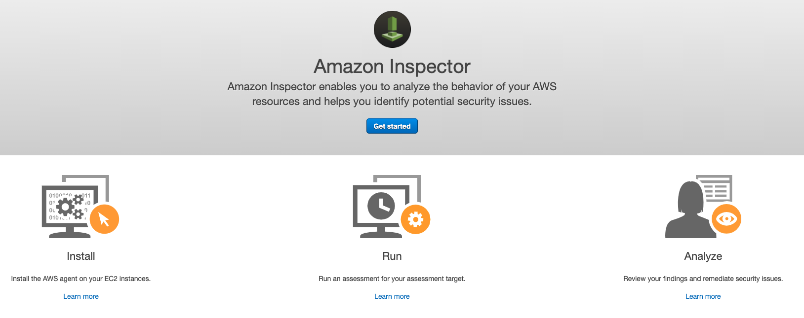

**What is Trusted Advisor?**

Helps reduce cost, increase performance, and improve security by optimizing the AWS environment, basically advices on AWS best practices. Not just EC2, looks at whole account.

Two tiers:

- Core checks and recommendations (free)
- Full trusted advisor (business and enterprise companies only)

Helpful to know the 5 pillars that Trusted Advisor checks for (in image below): **Cost Optimization, Performance, Security, Fault Tolerance, Service Limits**.

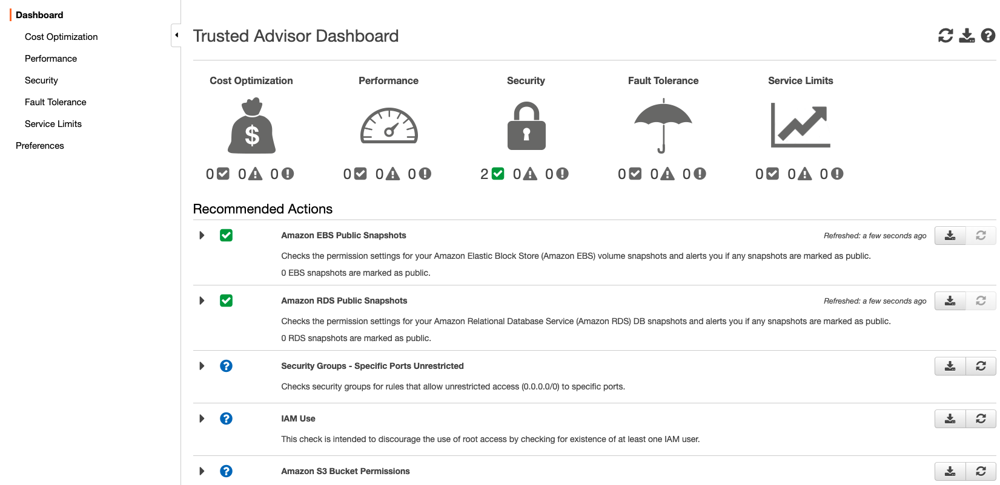

**CloudTrail**

Records AWS Management Console actions and API calls, can trail users and accounts to what made the calls when. Think of this like a CCTV camera for AWS account and user activity.

### AWS CloudWatch vs AWS Config

CloudWatch is all about monitoring performance (see [the previous CloudWatch section for more details](#cloudwatch-101)). :bulb: If you see a question about RDS performance that will be related to AWS CloudWatch.

AWS Config, however, is a detailed view of the configuration of your AWS resources in your account including how they relate to one another and how those relationships have changed over time. :bulb: Example exam question can be about locating security group changes, and Config is where you would find that information.

:bulb: The key between these sections is to be able to answer which service, if given a scenario, is the best to use.

### AWS Penetration Testing

What is penetration testing a.k.a. pen testing? Simulating a cyberattack to see how your envrionment stacks up. :bulb: There are **8** services you can run pen tests against without prior approval:

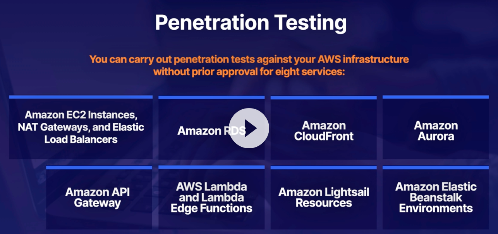

To get additional support with pen testing you must contact <aws-security-simulated-event@amazon.com> or [this page](https://aws.amazon.com/security/penetration-testing/).

### AWS Key Management Service (KMS) vs AWS CloudHSM

:bulb: Know the difference between the two and high level details.

KMS: Regional security key management and encryption/decryption. The keys you generate in N. Virginia will not work in Ohio. Manages customer master keys (CMKs). Ideal for S3 objects mostly, but also other things. Integrated with most AWS services. KMS is on _shared hardware_.

CloudHSM: Can do everything that KMS can do and more. Dedicated hardware security module (HSM). FIPS 140-2 Level 3 compliance. Single tenant, dedicated hardware.

### Parameter Store vs Secrets Manager

Both are palces to store passwords.

Paramter Store is for secure serverless storage for configurations and secrets. It is free, but 10,000 parameters per account max.

Secrets Manager is not free and is charged on a per 10k API call basis. Auto rotate secrets, apply new key/password in RDS for you, and generate random secrets.

### Amazon GuardDuty

Uses ML algorithms for anomaly detection in an AWS account / cloudtrail logs. One click to enable for a 30 day trial. Inout data includes CloudTrail, VPC, and DNS logs. Applied to _one account_.

### AWS Control Tower

Allows provision of multiple AWS accounts at once with conformance to company policies. Used for large enterprises with multiple AWS accounts.

### AWS Security Hub

Comprehensive view of your security alerts across multiple accounts. Better than having to log into separate accounts with Trusted Advisor. Alerts and findings can from multiple AWS services like GuardDuty, Inspector, IAM, etc.

### AWS Compomised IAM Credentials

Example: Someone stores their access key or secret access key in their scripts. 

First step is to identify what resources those credentials have access to.

Next invalidate those credentials by suspending and deleting in the IAM service.

Third, consider any temporary security credentials that might have been issued.

Last, restore the appropriate access.

### AWS Athena Vs Macie

**What is Athena?** An interactive query service for analyzing and querying data in S3 using standard SQL. It is serverless and pay per query / per TB scanned. Eliminates need for complex ETL processes. Works directly with data stored in S3.

**What is Macie?** Macie relates to Personally Identifiable Information (PII). Macie is a security service using ML and NLP to discover and protect sensitive data stored in S3. Helps to prevent ID theft and fraud.