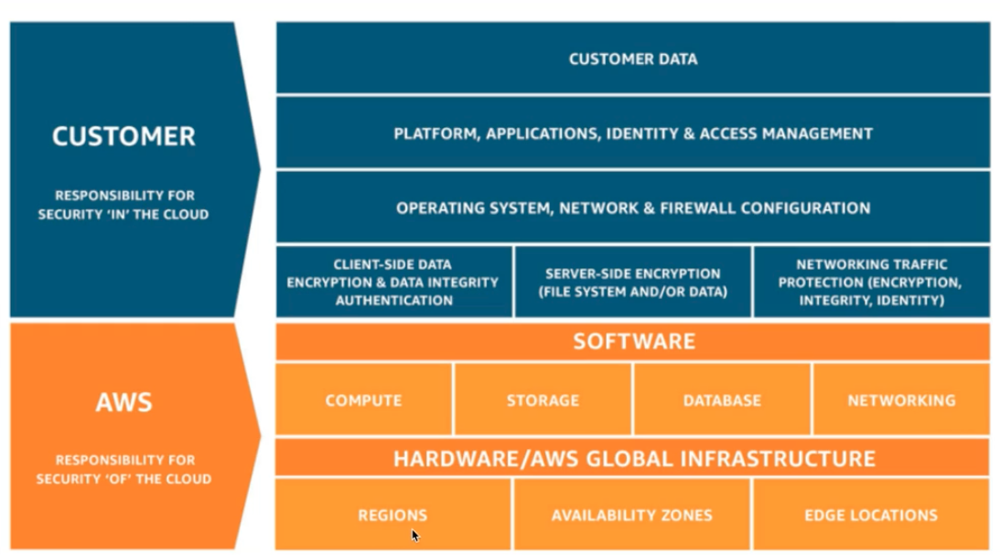
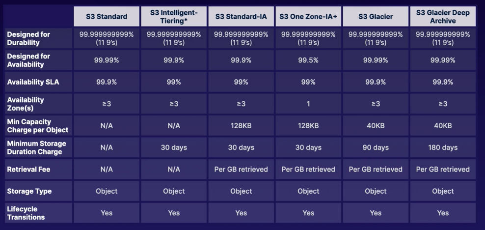

# A Cloud Guru Notes: AWS Certified Solutions Architect Associate Course

**Author:** Richard Hanna

The purpose of this document is to consolidate and highlight key notes from the lessons and labs in the [**AWS Solutions Architect Associate**](https://acloudguru.com/course/aws-certified-solutions-architect-associate-saa-c02) Course on A Cloud Guru.

This markdown is broken down by chapters in the course, with subsections based on the lectures and labs.

This is an admittedly scrawled series of notes, so please excuse any typos :sweat_smile:

**Symbol Key:**

- :bulb: = AWS exam likelihood

**Key AWS Resource and Links:**

- [AWS Shared Responsibility Model](https://aws.amazon.com/compliance/shared-responsibility-model/)
- [AWS Well Architected Framework (5 Pillars)](https://aws.amazon.com/blogs/apn/the-5-pillars-of-the-aws-well-architected-framework/)

## AWS Fundamentals

### The Building Blocks of AWS

**AWS Global Infrastructure:**

There are **24 regions & 77 availability zones**.

- **Regions**: A geographical region (us-east-1 i.e. N. Virginia) with 2+ availability zones
- **Availability Zones**: A Data center. Big building filled with servers. Could be multiple so an event doesnt take the whole zone offline. _There are always more AZ's than regions._
- **Edge Locations**: end points for AWS caching content. Ex: download a file from New York that can be retrieved from a cacheing server in London _There are always more edge locations than AZ's (and by proxy, regions).

### Who Owns What in the Cloud?

As in the cloud practitioner notes, know that you are repsonsible for what is _in_ the cloud while Amazon is responsible for the cloud itself. Security _in_ the cloud versus security _of_ the cloud.

:bulb: **Remember this diagram:**



Think if you're able to do something _yourself in the management console_? If so, the answer is it's likely your responsibility. If you can't control something, it's likely AWS' responsibility.

Check out AWS' page for more information about the [shared responsibility model here](https://aws.amazon.com/compliance/shared-responsibility-model/).

### Compute, Storage, Databases, & Networking

:bulb:

- **Compute** = The way we process information
  - EC2, Lambda, Elastic Beanstalk
- **Storage** = Giant disk in the cloud, a safe place to leave information
  - S3, Elastic Block Store (EBS), Elastic File Service (EFS), FSx, Storage Gateway
- **Databases** = A spreadsheet, a reliable way to store and retrieve information
  - RDS (Amazon Aurora, MySQL), DyanmoDB (noSQL), Redshift (data warehousing)
- **Networking** = Allows for communication between these resources
  - VPCs, Direct Connect, Route 53, API Gateway, AWS Global Accelerator

### What is the Well Architected Framework?

Read here to review the **[5 Pillars of the Well-Architected Framework](https://aws.amazon.com/blogs/apn/the-5-pillars-of-the-aws-well-architected-framework/)** :bulb: which are:

1) Operational Excellence
   1) Focuses on running and monitoring systems to deliver business value, and continually improving processes and procedures
2) Security
   1) Focuses on protecting information and systems
3) Reliability
   1) Focuses on ensuring a workload performs its intended function correctly and consistently when it's expected to
4) Performance Efficiency
   1) Focuses on using IT and computing resources efficiently
5) Cost Optimization
   1) Focuses on avoiding unnecessary costs

## Identity and Access Management (IAM)

### Securing the Root Account

The root account for AWS is the email address used to sign up for AWS, it has full admin access and is extremely important to keep secure.

One of the best things to do immediately is to turn on multi-factor authentication for the root account using a resource like Google's MFA service. This can be done under IAM.

There are 4 steps to securing a root account:

1) Enable MFA
2) Create an admin group for admins and assign appropriate permissions to it
3) Create user accounts for admins
4) Add those users to the admin group

### Controlling Users' Actions with IAM

Permissions are assigned to users using policy documents. Policy documents are made using JSON files. :bulb: **You will need to know how to read JSON files for the exam!** Policy documents can be assigned to groups, users, and roles though it is typically frowned upon to assign to and manage policies at the user level. It is better to assign users to groups and have users inherit permissions from those groups.

> :bulb: Note that IAM is a global service and not a regional one!

Sample JSON notation for a policy can look something like this:

```JSON
{
   "Version": "2017-10-17",
   "Statement": [
      {
         "Effect": "Allow",
         "Action": "*",
         "Resource": "*"
      }
   ]
}
```

Which is essentially an admin policy allowing all actions for all resources.

### Permanent IAM Credentials

- User = One physical person
- Group = Users grouped by a function (ex: admin, dev, etc)
- Roles = Internal usage within AWS

IAM policies should always be applied to Groups instead of individual Users.

**:bulb: The Principle of Least Privilege** is the assignment of the minimum privileges a user needs to do their job.

Note: PowerUserAccess, i.e. PowerUsers, are basically admin but they can't create users or groups and don't have access privileges to those in IAM.

:bulb: **Exam Note**: If you ever see a question about making your username and password the same as your AWS log in account it is related to **Active Directory Federation** using the SAML standard.

Also note that new users come with no permissions when they are first created, permissions _must_ be assigned to them.

**Exam Notes :bulb:**

- "EAR" in a policy document stands for: "Effect, Action, Resource" (see the example in the JSON above!)
- IAM users are considered "permanent" because user credentials don't automatically rotate, making them "permanent" without manual human interaction.
- "deny" statements will always override "allow" statements, not the other way around

## Simple Storage Service (S3)

### S3 Overview

- S3 is basically a hard drive in the cloud for object storage for files, _not_ for operating systems.
- S3 has unlimited storage and objects can be as large as 5 TB.
- S3 is a univeral namespace, so every S3 bucket name must be unique.
  - S3 URLs always follow the formula `https://bucket-name.s3.Region.amazonaws.com/key-name`
    - i.e. `https://acouldguru.s3.us-east-1.amazonaws.com/Ralphie.jpg`
- S3 successful browser uploads return a HTTP 200 code
- S3 works with key-value stores
  - key = name of the object
  - value = byte sequence of the data itself
  - version ID
  - Metadata = data about the data
- S3 is extremely safe and secure, data is always spread across multiple devices and multiple facilities. Makinging it highly available and durable.

#### Tiers of S3

**S3 Standard:**

- High availability and durability
- Frequently accessed
- Suitable for most workloads

Data Security is made possible via:

- Server-side encryption: user-set encryption on a bucket to encrypt, for example, all new objects when stored in the bucket
- Access Control Lists (ACLs): ACLs define which AWS accounts or groups can access and the types of access. ACLs can also be attached to individual objects in a bucket
- Bucket Policies: Specific policies for what actions are allowed or denied  such as PUTs and DELETEs

:bulb: S3 buckets have strong **Read-After-Write Consistency** so after every successful write of a new object (PUT) or overwrite of existing objects, subsequent read requests are immediately available. They also have strong consistency for list operations, so after a write you can immediately perform a listing of the objects in the bucket and see the changes.

### Securing Your Buckets with S3 Block Public Access

:bulb: Bucket policies apply to entire bucket levels, while object Access Control Lists (ACLs) work on an individual object level.

To make an individual S3 bucket object public, check the object in the list inside the bucket and select "Make Public" in the drop down options for the object.

To make the bucket itself public, you have to open the bucket permissions and uncheck the block accesses. Note that if the bucket itself is private and you make an object public, the bucket policy will provide an error and override the object declaration. However, a bucket can be public while an object underneath can remain private.

- Buckets are private by default
- Successful object uploads result in a HTTP 200 status code

### Hosting a Static Website Using S3

Examples include HTML/.html sites.

S3 scales automatically to meet demand, so for static sites you dont have to worry about load balancing or auto scaling.

In this lesson we create a static webpage using a Bucket Policy in JSON (below) and an HTML file (below):

**Bucket Policy**
```JSON
{
	"Version": "2012-10-17",
	"Statement": [
		{
			"Sid": "PublicReadGetObject",
			"Effect": "Allow",
			"Principal": "*",
			"Action": [
				"s3:GetObject"
			],
			"Resource": [
				"arn:aws:s3:::BUCKET_NAME/*"
			]
		}
	]
}
```

**HTML Content**
```HTML
# index.html

<html>
	<title>
		<head>Hello Cloud Gurus</head>
	</title>
	<body>
		<div align="center">
			<h1>Hello Cloud Gurus!</h1>
			
		</div>
	</body>
</html>

# error.html

<html>
	<title>
		<head>Error Cloud Gurus</head>
	</title>
	<body>
		<div align="center">
			<h1>Sorry Cloud Gurus, there has been an error!</h1>
			
		</div>
	</body>
</html>
```

After creating the bucket and opening access, there is an option under "Properties" for static website hosting enabling. There, you will specify your index and error HTML files that will be loaded. The properties page gives a URL to visit.

The HTML files are uploaded to the bucket and the policy is applied to the bucket by editing the bucket policy and pasting the JSON above. This allows you to get to the web page by clicking on the link under the bucket properties.

:bulb: Exam Tip: Anything related to "static" websites relates to S3.

### Versioning Objects in S3

Objects in S3 buckets can have multiple versions. This lets you have all versions of all writes of you objects and even deletes, making it a good back up solution. Though you must note that once versioning is enabled it can never be disabled, only suspended. Versioning also supports multi-factor authentication :bulb:, this can prevent accidental deletion of multiple versions of an object.

Versioning can be found under bucket Properties, and enabling bucket versioning. In the lecture, a second version of the index.html file is uploaded, and when viewing the bucket objects you can see branching versions of the objects.

Note that once a new version is uploaded, previous versions no longer become public even if the bucket policy is public! :bulb: You would have to make the specific object public.

When the index.html object gets deleted, at the top level view it appears no index.html object exists, however by clicking on list versions all 3 versions of the index file are shown still with a "Delete marker" next to it. By deleting the "Delete marker" you can restore the object.

### :bulb: S3 Storage Classes

- **S3 Standard**: High availability and frequent access. The default set up.
- **S3 Standard-Infrequent Access**: Rapid access but you pay to access the data. Great for long-term storage, backups, etc.
- **S3 One Zone-Infrequent Access**: Like S3 Standard IA, but in one single Availability Zone. 20% less cost than regular S3 IA. Great for long lived, IA, non-critical data.
- **S3 Glacier**: Provides long-term data archiving with retrieval times of 1minute to 12 hours. Very cheap, optimized for very infrequent access, every time you access you pay. :bulb: "archiving" = _glacier services_
- **S3 Glacier Deep Archive**: Rarely accessed data with a default retrieval time of 12 hours. Cheapest option possible.
- **S3 Intelligent-Tiering**: Auto moves your data to the most cost-effective tier based on how frequently you access each object using machine learning. _Optimizes cost_.



### Lifecycle Management with S3

What is lifecycle management?

> Automates moving of objects between different storage tiers to maximize cost savings.

Example: You have an object you put in S3 Standard but it doesnt get used for 30 days, so gets moved to S3 IA, then after another 90 days it gets moved to Glacier.

Lifecycle management can be combined with versioning. Lifecycle management rules can be found in your bucket under "Lifecycle configuration" where you can "Create lifecycle rule".

:bulb: **Exam Tips:**

- Automates moving objects between different storage tiers
- Can be used with versioning
- Can be applied to current and previous verisons

### S3 Object Lock and Glacier Vault Lock

:bulb: S3 Object Lock is used to store object using a **write once, read many (WORM)** model to preven objects from being deleted or modigied for a fixed amount of time or indefinitely. S3 Object Lock can be used to meet regulatory requirements mandating WORM storage for extra protection against object changes or deletions.

S3 Object Lock Modes:

- **Governance Mode:** Users can't overwrite or delete an object version or alter its lock settings without permissions. This protects objects against deletion by most users, but you can still alter or grant permisions to allow it if necessary
- **Compliance Mode:** Ensures no one can delete or overwrite objects including the root users. This mode ensures an object version can't be overwritten or deleted for the duration of the fixed retention period (a defined retention period can't be shortened).
  - **Retention periods** protect an object version for a fixed amount of time, afterwards it can be overwritten or deleted
  - **Legal Holds** are like retention periods in that they prevent object overwrites or deletions, however a legal hold doesn't have an assocaited retention period. It remains in effect until it is removed
    - Only removable by users with the `s3:PutObjectLoegalHold` permission

**Glacier Vault Lock** allows deployment and enforcement of complaince controls for individual S3 Glacier vaults. **Basically it applies the WORM model to Glacier Vaults.** :bulb:

### Encrypting S3 Objects

**Types of Encryption:** :bulb:

- Encryption in Transit
  - Objects being sent to and from the bucket
  - SSL/TLS
  - HTTPS (S means encrption using SSL over port 443)
- Encryption at Rest: Server-Side Encryption
  - SSE-S3: S3-managed keys, using AES 256-bit encryption (most common type)
  - SSE-KMS: AWS Key Management Service-managed keys
  - SSE-C: Customer provided keys
- Encryption at Rest: Client-Side Encryption
  - You encrypt the files yourself before uploading to S3

Two ways to enforce server-side encryption:

- Console via ecnryption setting selection on your S3 bucket, easiest way is just a checkbox on the console
- Bucket policy via enforcing encryption using a policy :bulb:

When enforcing server-side encryption, anytime you upload a file you have a PUT request. `x-amz-server-side-encryption` is included as a parameter in the request header and has one of two options:

- `x-amz-server-side-encryption: AES256` (SSE-S3 S3 Managed Keys)
- `x-amz-server-side-encryption: aws:kms` (SSE-KMS - KMS-managed keys)

When the parameter is included it tells S3 to encrypt on upload using these parameters. This can allow you to deny PUT requests that don't have these parameters.

### Optimizing S3 Performance

:bulb: **S3 Prefixes:** The folders inside the buckets.


**S3 Performance:** Extremely low latency, the first byte out of S3 can be retrieved in 100-200 miliseconds. If you want better performance, you would spread your "reads" across different prefixes/directories. If one prefix gets you 11,000 requests per second, then 4 prefixes gets you 4x that.

:bulb: If using SSE-KMS, there are some limitations. Encrypted objects have KMS limits. When you upload a file you will call `GenerateDataKey` in the KMS API and when you download a file you will call `Decrypt`. KMS has request rates that can't be changed, so encryption rates are better off using S3 and _not_ KMS.

:bulb: **S3 Performance: Uploads & Downloads**

- Multipart Uploads: Recommended for >100mb file size, required for files >5Gb, parallelize uploads to increase efficiency
  - Split a big file into little files and upload at the same time
- S3 Byte Range Fetches: Parallelize downloads by specifying byte ranges, making failures in the download only in that byte range
  - Split a big file into small chunks for parallel downloads

### Backing Up Data with S3 Replication

What is S3 Replication?

> Replicating objects from one bucket to another. It requires versioning enabled in source and destination buckets. Objects in an existing bucket are not replicated automatically, and delete markets are not replicated by default (though you can turn them on).

Replication is under Management -> Lifecycle Management -> Replication Rules. Here you will pick your source bucket, objects, and destination bucket.

Replication requires an IAM role, but one can be autocreated by default.

## Elastic Compute Cloud (EC2)

### EC2 Overview

**There are (4) EC2 Pricing Options:**


- **On Demand**: Low cost and flexible, best for short-term or spiky/unpredictable workloads. Best for testing and development purposes.
- **Reserved**: Predictable, steady state usage with specific capacity requirements. Allows you to pay up front (the more you pay the more you save).
  - Convertible Reserved saves less than standard reserved but still more than on demand.
  - Scheduled reserved lets you match capacity to requirements for, example, daytime working hours.
  - Reserved instances operate on a regional level
- **Spot Instances**: Applications with flexible stop and end times, not useful for websites because when you reached capacity your instance will get terminated. They are cost sensitive and good for urgent needs of additional computing capacity.
- **Dedicated Hosts**: Can be good for compliance requirements, licensing. Can be purchased on-demand (hourly) or reserve them for a discount.

### AWS Command Line

To access the EC2 instance, ensure that your .pem key is accessible and the permissions are correct (if they aren't, `chmod 400 <yourkeyname>.pem`).

Connect to the EC2 instance using `ssh ec2-user@<ip> -i <yourkeyname>.pem`.

If you have an appropriate IAM configured through the AWS CLI, you can use `aws ls s3` to list all available buckets. Similarly you can create a bucket using `aws s3 mb s3://<bucketname>` to make a new bucket programmatically.

To create a file for the bucket:

```bash
aws s3 cp <yourtextsamplefile.txt> s3://<bucketname>
```

### Using Roles

**Roles are temporary**, they do not have standard long-term credentials the same way passwords or access keys do. Instead a user assumes a role and the role provides temporary security credentials for the role session.

Roles are:

- The preferred security option
- Allow avoidance of hard coding credentials
- Use policies to control permissions
- Allow for policy updates attached to roles for immediate effect
- Can be attached and detached from running EC2 instances without stopping the instances

### Security Groups & Bootstrap Scripts

Ports for computer communication:

- Linux SSH: Port 22
- Windows RDP: Port 3389
- HTTP Web Browsing: Port 80
- HTTPS Encrypted Web Browsing (SSL): Port 443

Security groups are **virtual firewalls for your EC2 instance**. By default everything is blocked.

**Bootstrap scripts** are scripts that run when the instance first starts. In the lecture demo there is a sample SSH bootstrap script that you simply paste under "Advanced details" in "User Data" for the bootstrap startup commands.

```bash
# Sample bootstrap script
#!/bin/bash
yum update -y
yum install httpd -y
systemctl start httpd
systemctl enable httpd
cd /var/www/html
echo "<html><body><h1>Hello Cloud Gurus</h1></body></html>" > index.html
```

Paste the above commands here:


:bulb: Exam Tips:

- Changes to security groups take place immediately
- You can have any number of EC2 instances in a security group
- You can have multiple security groups attached to an EC2 instance
- All inbound traffic is blocked by default
- All outbound traffic is allowed by default

Bootstrap scripts are an example of **user data**.
### EC2 Metadata and User Data

Metadata = data about data. EC2 metadata = data about the EC2 instance.

To retrieve metadata use the command:

```bash
curl http://169.254.169.254/latest/meta-data/
```

In this lecture, we combine **user data** with **meta data** by running the below bootstrap script to save out IP address to a text file on startup:

```bash
#!/bin/bash
yum update -y
yum install httpd -y
service httpd start
cd /var/www/html
echo "<html><body><h1>My IP is" > index.html 
curl http://169.254.169.254/latest/meta-data/public-ipv4 >> index.html
echo "</h1></body></html>" >> index.html 
```

While in the EC2 instance itself you can use the same `curl` command above to see a list of options for metadata selection including iPv4 address and many other things.

### Networking with EC2

There are 3 types of virtual networking cards for EC2 instances:


ENI is a virtual network card best for creating a management network and used in network and security appliances in your VPC. You can create dual-homed instances with workloads/roles on distinct subnects. **It is low budget and high availability**.

EN is for high performance networking. Can use an elastic network adapter (ENA) or an intel virtual function interface (VF). :bulb: **If an exam question asks about which of these two to use, you almost always want to use the ENA over the VF**.

EFA is a network device to accelerate **high performance computing and machine learning computations**. They can also use an **OS-Bypass** allowing for faster processing and lower latency. :bulb:


### Optimizing with EC2 Placement Groups

There are 3 Types of Placement Groups:

- Cluster
- Spread
- Partition

**Cluster Placement Groups** are groups of EC2 instances in a single AZ. Recommended for apps that need low network latency, high network throughput, or both. Only certain instance types can be launched through these (GPU optimized, compute optimized, memory optimized, storage optimized). AWS recommends **homogenous instances** within cluster placement groups.

**Spread Placement Groups** are a group of instances placed on distinct underlying hardware. Best for apps that have a small number of critical instances that should be kept separate from each other.

**Partition Placement Groups** are groups of instances where each group has its own set of racks, allowing for isolation of hardware failure. Multiple EC2 instances; HDFS, HBase, and Cassandra.

You cannot merge placement groups. You can move an existing instance into a placement group, but it must be in a stopped state (can only be done with AWS CLI or SDK).