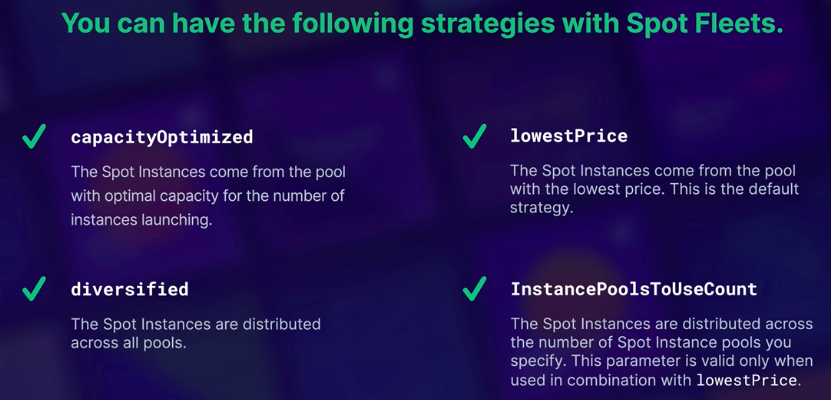
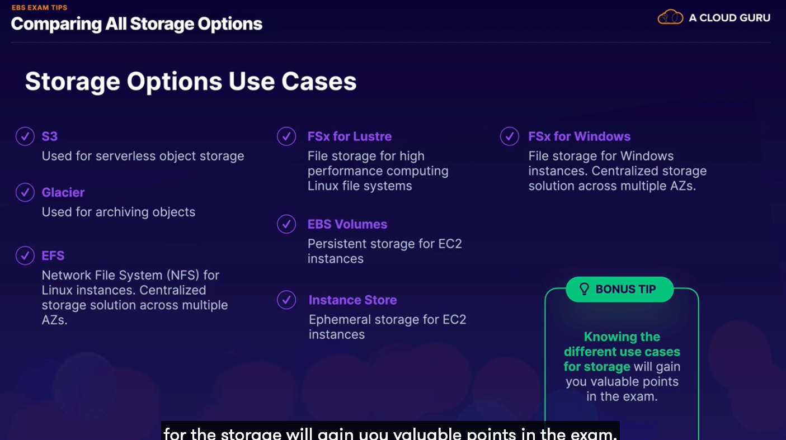
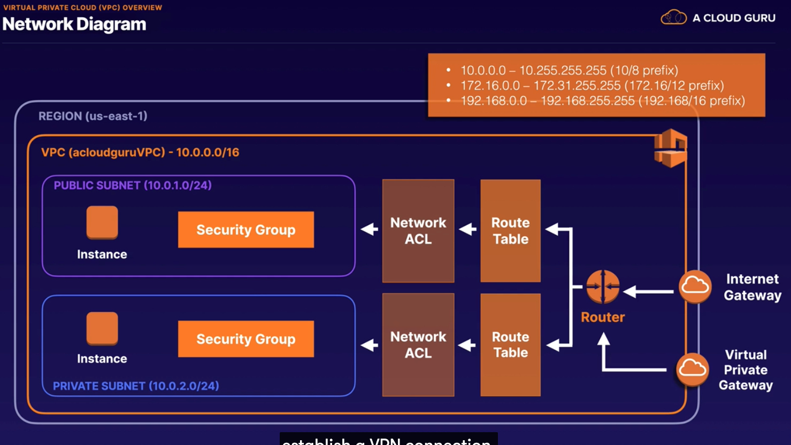
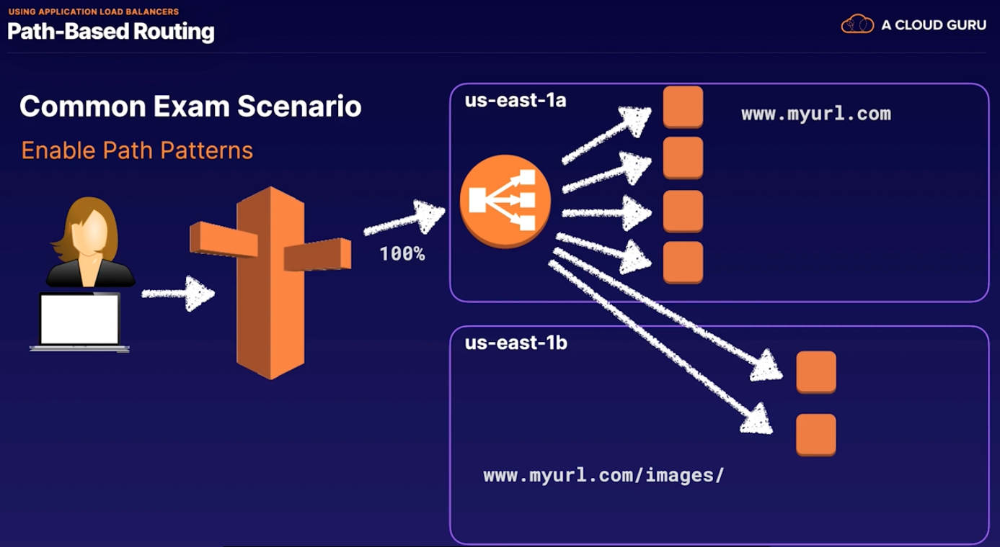
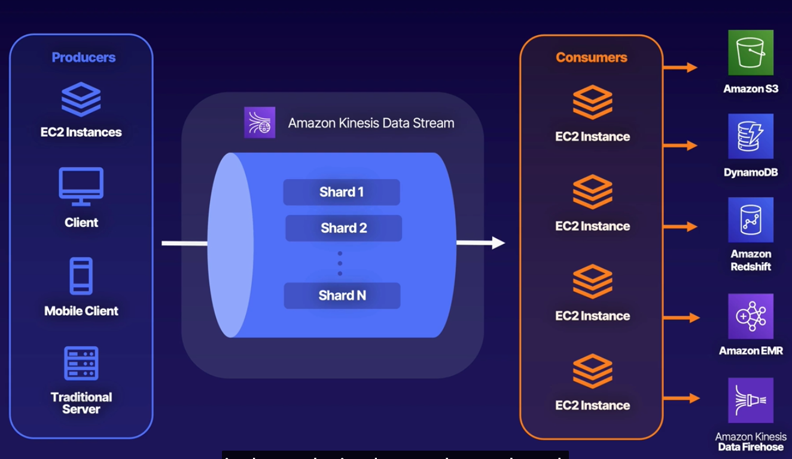

# A Cloud Guru Notes: AWS Certified Solutions Architect Associate Course

**Author:** Richard Hanna

The purpose of this document is to consolidate and highlight key notes from the lessons and labs in the [**AWS Solutions Architect Associate**](https://acloudguru.com/course/aws-certified-solutions-architect-associate-saa-c02) Course on A Cloud Guru.

This markdown is broken down by chapters in the course, with subsections based on the lectures and labs.

This is an admittedly scrawled series of notes, so please excuse any typos :sweat_smile:

**Symbol Key:**

- :bulb: = AWS exam likelihood

**Key AWS Resource and Links:**

- [AWS Shared Responsibility Model](https://aws.amazon.com/compliance/shared-responsibility-model/)
- [AWS Well Architected Framework (5 Pillars)](https://aws.amazon.com/blogs/apn/the-5-pillars-of-the-aws-well-architected-framework/)

## AWS Fundamentals

### The Building Blocks of AWS

**AWS Global Infrastructure:**

There are **24 regions & 77 availability zones**.

- **Regions**: A geographical region (us-east-1 i.e. N. Virginia) with 2+ availability zones
- **Availability Zones**: A Data center. Big building filled with servers. Could be multiple so an event doesnt take the whole zone offline. _There are always more AZ's than regions._
- **Edge Locations**: end points for AWS caching content. Ex: download a file from New York that can be retrieved from a cacheing server in London _There are always more edge locations than AZ's (and by proxy, regions).

### Who Owns What in the Cloud?

As in the cloud practitioner notes, know that you are repsonsible for what is _in_ the cloud while Amazon is responsible for the cloud itself. Security _in_ the cloud versus security _of_ the cloud.

:bulb: **Remember this diagram:**


Think if you're able to do something _yourself in the management console_? If so, the answer is it's likely your responsibility. If you can't control something, it's likely AWS' responsibility.

Check out AWS' page for more information about the [shared responsibility model here](https://aws.amazon.com/compliance/shared-responsibility-model/).

### Compute, Storage, Databases, & Networking

:bulb:

- **Compute** = The way we process information
  - EC2, Lambda, Elastic Beanstalk
- **Storage** = Giant disk in the cloud, a safe place to leave information
  - S3, Elastic Block Store (EBS), Elastic File Service (EFS), FSx, Storage Gateway
- **Databases** = A spreadsheet, a reliable way to store and retrieve information
  - RDS (Amazon Aurora, MySQL), DyanmoDB (noSQL), Redshift (data warehousing)
- **Networking** = Allows for communication between these resources
  - VPCs, Direct Connect, Route 53, API Gateway, AWS Global Accelerator

### What is the Well Architected Framework?

Read here to review the **[5 Pillars of the Well-Architected Framework](https://aws.amazon.com/blogs/apn/the-5-pillars-of-the-aws-well-architected-framework/)** :bulb: which are:

1) Operational Excellence
   1) Focuses on running and monitoring systems to deliver business value, and continually improving processes and procedures
2) Security
   1) Focuses on protecting information and systems
3) Reliability
   1) Focuses on ensuring a workload performs its intended function correctly and consistently when it's expected to
4) Performance Efficiency
   1) Focuses on using IT and computing resources efficiently
5) Cost Optimization
   1) Focuses on avoiding unnecessary costs

## Identity and Access Management (IAM)

### Securing the Root Account

The root account for AWS is the email address used to sign up for AWS, it has full admin access and is extremely important to keep secure.

One of the best things to do immediately is to turn on multi-factor authentication for the root account using a resource like Google's MFA service. This can be done under IAM.

There are 4 steps to securing a root account:

1) Enable MFA
2) Create an admin group for admins and assign appropriate permissions to it
3) Create user accounts for admins
4) Add those users to the admin group

### Controlling Users' Actions with IAM

Permissions are assigned to users using policy documents. Policy documents are made using JSON files. :bulb: **You will need to know how to read JSON files for the exam!** Policy documents can be assigned to groups, users, and roles though it is typically frowned upon to assign to and manage policies at the user level. It is better to assign users to groups and have users inherit permissions from those groups.

> :bulb: Note that IAM is a global service and not a regional one!

Sample JSON notation for a policy can look something like this:

```JSON
{
   "Version": "2017-10-17",
   "Statement": [
      {
         "Effect": "Allow",
         "Action": "*",
         "Resource": "*"
      }
   ]
}
```

Which is essentially an admin policy allowing all actions for all resources.

### Permanent IAM Credentials

- User = One physical person
- Group = Users grouped by a function (ex: admin, dev, etc)
- Roles = Internal usage within AWS

IAM policies should always be applied to Groups instead of individual Users.

**:bulb: The Principle of Least Privilege** is the assignment of the minimum privileges a user needs to do their job.

Note: PowerUserAccess, i.e. PowerUsers, are basically admin but they can't create users or groups and don't have access privileges to those in IAM.

:bulb: **Exam Note**: If you ever see a question about making your username and password the same as your AWS log in account it is related to **Active Directory Federation** using the SAML standard.

Also note that new users come with no permissions when they are first created, permissions _must_ be assigned to them.

**Exam Notes :bulb:**

- "EAR" in a policy document stands for: "Effect, Action, Resource" (see the example in the JSON above!)
- IAM users are considered "permanent" because user credentials don't automatically rotate, making them "permanent" without manual human interaction.
- "deny" statements will always override "allow" statements, not the other way around

## Simple Storage Service (S3)

### S3 Overview

- S3 is basically a hard drive in the cloud for object storage for files, _not_ for operating systems.
- S3 has unlimited storage and objects can be as large as 5 TB.
- S3 is a univeral namespace, so every S3 bucket name must be unique.
  - S3 URLs always follow the formula `https://bucket-name.s3.Region.amazonaws.com/key-name`
    - i.e. `https://acouldguru.s3.us-east-1.amazonaws.com/Ralphie.jpg`
- S3 successful browser uploads return a HTTP 200 code
- S3 works with key-value stores
  - key = name of the object
  - value = byte sequence of the data itself
  - version ID
  - Metadata = data about the data
- S3 is extremely safe and secure, data is always spread across multiple devices and multiple facilities. Makinging it highly available and durable.

#### Tiers of S3

**S3 Standard:**

- High availability and durability
- Frequently accessed
- Suitable for most workloads

Data Security is made possible via:

- Server-side encryption: user-set encryption on a bucket to encrypt, for example, all new objects when stored in the bucket
- Access Control Lists (ACLs): ACLs define which AWS accounts or groups can access and the types of access. ACLs can also be attached to individual objects in a bucket
- Bucket Policies: Specific policies for what actions are allowed or denied  such as PUTs and DELETEs

:bulb: S3 buckets have strong **Read-After-Write Consistency** so after every successful write of a new object (PUT) or overwrite of existing objects, subsequent read requests are immediately available. They also have strong consistency for list operations, so after a write you can immediately perform a listing of the objects in the bucket and see the changes.

### Securing Your Buckets with S3 Block Public Access

:bulb: Bucket policies apply to entire bucket levels, while object Access Control Lists (ACLs) work on an individual object level.

To make an individual S3 bucket object public, check the object in the list inside the bucket and select "Make Public" in the drop down options for the object.

To make the bucket itself public, you have to open the bucket permissions and uncheck the block accesses. Note that if the bucket itself is private and you make an object public, the bucket policy will provide an error and override the object declaration. However, a bucket can be public while an object underneath can remain private.

- Buckets are private by default
- Successful object uploads result in a HTTP 200 status code

### Hosting a Static Website Using S3

Examples include HTML/.html sites.

S3 scales automatically to meet demand, so for static sites you dont have to worry about load balancing or auto scaling.

In this lesson we create a static webpage using a Bucket Policy in JSON (below) and an HTML file (below):

**Bucket Policy:**

```JSON
{
 "Version": "2012-10-17",
 "Statement": [
  {
   "Sid": "PublicReadGetObject",
   "Effect": "Allow",
   "Principal": "*",
   "Action": [
    "s3:GetObject"
   ],
   "Resource": [
    "arn:aws:s3:::BUCKET_NAME/*"
   ]
  }
 ]
}
```

**HTML Content:**

```HTML
# index.html

<html>
 <title>
  <head>Hello Cloud Gurus</head>
 </title>
 <body>
  <div align="center">
   <h1>Hello Cloud Gurus!</h1>
   
  </div>
 </body>
</html>

# error.html

<html>
 <title>
  <head>Error Cloud Gurus</head>
 </title>
 <body>
  <div align="center">
   <h1>Sorry Cloud Gurus, there has been an error!</h1>
   
  </div>
 </body>
</html>
```

After creating the bucket and opening access, there is an option under "Properties" for static website hosting enabling. There, you will specify your index and error HTML files that will be loaded. The properties page gives a URL to visit.

The HTML files are uploaded to the bucket and the policy is applied to the bucket by editing the bucket policy and pasting the JSON above. This allows you to get to the web page by clicking on the link under the bucket properties.

:bulb: Exam Tip: Anything related to "static" websites relates to S3.

### Versioning Objects in S3

Objects in S3 buckets can have multiple versions. This lets you have all versions of all writes of you objects and even deletes, making it a good back up solution. Though you must note that once versioning is enabled it can never be disabled, only suspended. Versioning also supports multi-factor authentication :bulb:, this can prevent accidental deletion of multiple versions of an object.

Versioning can be found under bucket Properties, and enabling bucket versioning. In the lecture, a second version of the index.html file is uploaded, and when viewing the bucket objects you can see branching versions of the objects.

Note that once a new version is uploaded, previous versions no longer become public even if the bucket policy is public! :bulb: You would have to make the specific object public.

When the index.html object gets deleted, at the top level view it appears no index.html object exists, however by clicking on list versions all 3 versions of the index file are shown still with a "Delete marker" next to it. By deleting the "Delete marker" you can restore the object.

### :bulb: S3 Storage Classes

- **S3 Standard**: High availability and frequent access. The default set up.
- **S3 Standard-Infrequent Access**: Rapid access but you pay to access the data. Great for long-term storage, backups, etc.
- **S3 One Zone-Infrequent Access**: Like S3 Standard IA, but in one single Availability Zone. 20% less cost than regular S3 IA. Great for long lived, IA, non-critical data.
- **S3 Glacier**: Provides long-term data archiving with retrieval times of 1minute to 12 hours. Very cheap, optimized for very infrequent access, every time you access you pay. :bulb: "archiving" = _glacier services_
- **S3 Glacier Deep Archive**: Rarely accessed data with a default retrieval time of 12 hours. Cheapest option possible.
- **S3 Intelligent-Tiering**: Auto moves your data to the most cost-effective tier based on how frequently you access each object using machine learning. _Optimizes cost_.


### Lifecycle Management with S3

What is lifecycle management?

> Automates moving of objects between different storage tiers to maximize cost savings.

Example: You have an object you put in S3 Standard but it doesnt get used for 30 days, so gets moved to S3 IA, then after another 90 days it gets moved to Glacier.

Lifecycle management can be combined with versioning. Lifecycle management rules can be found in your bucket under "Lifecycle configuration" where you can "Create lifecycle rule".

:bulb: **Exam Tips:**

- Automates moving objects between different storage tiers
- Can be used with versioning
- Can be applied to current and previous verisons

### S3 Object Lock and Glacier Vault Lock

:bulb: S3 Object Lock is used to store object using a **write once, read many (WORM)** model to preven objects from being deleted or modigied for a fixed amount of time or indefinitely. S3 Object Lock can be used to meet regulatory requirements mandating WORM storage for extra protection against object changes or deletions.

S3 Object Lock Modes:

- **Governance Mode:** Users can't overwrite or delete an object version or alter its lock settings without permissions. This protects objects against deletion by most users, but you can still alter or grant permisions to allow it if necessary
- **Compliance Mode:** Ensures no one can delete or overwrite objects including the root users. This mode ensures an object version can't be overwritten or deleted for the duration of the fixed retention period (a defined retention period can't be shortened).
  - **Retention periods** protect an object version for a fixed amount of time, afterwards it can be overwritten or deleted
  - **Legal Holds** are like retention periods in that they prevent object overwrites or deletions, however a legal hold doesn't have an assocaited retention period. It remains in effect until it is removed
    - Only removable by users with the `s3:PutObjectLoegalHold` permission

**Glacier Vault Lock** allows deployment and enforcement of complaince controls for individual S3 Glacier vaults. **Basically it applies the WORM model to Glacier Vaults.** :bulb:

### Encrypting S3 Objects

**Types of Encryption:** :bulb:

- Encryption in Transit
  - Objects being sent to and from the bucket
  - SSL/TLS
  - HTTPS (S means encrption using SSL over port 443)
- Encryption at Rest: Server-Side Encryption
  - SSE-S3: S3-managed keys, using AES 256-bit encryption (most common type)
  - SSE-KMS: AWS Key Management Service-managed keys
  - SSE-C: Customer provided keys
- Encryption at Rest: Client-Side Encryption
  - You encrypt the files yourself before uploading to S3

Two ways to enforce server-side encryption:

- Console via ecnryption setting selection on your S3 bucket, easiest way is just a checkbox on the console
- Bucket policy via enforcing encryption using a policy :bulb:

When enforcing server-side encryption, anytime you upload a file you have a PUT request. `x-amz-server-side-encryption` is included as a parameter in the request header and has one of two options:

- `x-amz-server-side-encryption: AES256` (SSE-S3 S3 Managed Keys)
- `x-amz-server-side-encryption: aws:kms` (SSE-KMS - KMS-managed keys)

When the parameter is included it tells S3 to encrypt on upload using these parameters. This can allow you to deny PUT requests that don't have these parameters.

### Optimizing S3 Performance

:bulb: **S3 Prefixes:** The folders inside the buckets.


**S3 Performance:** Extremely low latency, the first byte out of S3 can be retrieved in 100-200 miliseconds. If you want better performance, you would spread your "reads" across different prefixes/directories. If one prefix gets you 11,000 requests per second, then 4 prefixes gets you 4x that.

:bulb: If using SSE-KMS, there are some limitations. Encrypted objects have KMS limits. When you upload a file you will call `GenerateDataKey` in the KMS API and when you download a file you will call `Decrypt`. KMS has request rates that can't be changed, so encryption rates are better off using S3 and _not_ KMS.

:bulb: **S3 Performance: Uploads & Downloads**

- Multipart Uploads: Recommended for >100mb file size, required for files >5Gb, parallelize uploads to increase efficiency
  - Split a big file into little files and upload at the same time
- S3 Byte Range Fetches: Parallelize downloads by specifying byte ranges, making failures in the download only in that byte range
  - Split a big file into small chunks for parallel downloads

### Backing Up Data with S3 Replication

What is S3 Replication?

> Replicating objects from one bucket to another. It requires versioning enabled in source and destination buckets. Objects in an existing bucket are not replicated automatically, and delete markets are not replicated by default (though you can turn them on).

Replication is under Management -> Lifecycle Management -> Replication Rules. Here you will pick your source bucket, objects, and destination bucket.

Replication requires an IAM role, but one can be autocreated by default.

## Elastic Compute Cloud (EC2)

### EC2 Overview

**There are (4) EC2 Pricing Options:**


- **On Demand**: Low cost and flexible, best for short-term or spiky/unpredictable workloads. Best for testing and development purposes.
- **Reserved**: Predictable, steady state usage with specific capacity requirements. Allows you to pay up front (the more you pay the more you save).
  - Convertible Reserved saves less than standard reserved but still more than on demand.
  - Scheduled reserved lets you match capacity to requirements for, example, daytime working hours.
  - Reserved instances operate on a regional level
- **Spot Instances**: Applications with flexible stop and end times, not useful for websites because when you reached capacity your instance will get terminated. They are cost sensitive and good for urgent needs of additional computing capacity.
- **Dedicated Hosts**: Can be good for compliance requirements, licensing. Can be purchased on-demand (hourly) or reserve them for a discount.

### AWS Command Line

To access the EC2 instance, ensure that your .pem key is accessible and the permissions are correct (if they aren't, `chmod 400 <yourkeyname>.pem`).

Connect to the EC2 instance using `ssh ec2-user@<ip> -i <yourkeyname>.pem`.

If you have an appropriate IAM configured through the AWS CLI, you can use `aws ls s3` to list all available buckets. Similarly you can create a bucket using `aws s3 mb s3://<bucketname>` to make a new bucket programmatically.

To create a file for the bucket:

```bash
aws s3 cp <yourtextsamplefile.txt> s3://<bucketname>
```

### Using Roles

**Roles are temporary**, they do not have standard long-term credentials the same way passwords or access keys do. Instead a user assumes a role and the role provides temporary security credentials for the role session.

Roles are:

- The preferred security option
- Allow avoidance of hard coding credentials
- Use policies to control permissions
- Allow for policy updates attached to roles for immediate effect
- Can be attached and detached from running EC2 instances without stopping the instances

### Security Groups & Bootstrap Scripts

Ports for computer communication:

- Linux SSH: Port 22
- Windows RDP: Port 3389
- HTTP Web Browsing: Port 80
- HTTPS Encrypted Web Browsing (SSL): Port 443

Security groups are **virtual firewalls for your EC2 instance**. By default everything is blocked.

**Bootstrap scripts** are scripts that run when the instance first starts. In the lecture demo there is a sample SSH bootstrap script that you simply paste under "Advanced details" in "User Data" for the bootstrap startup commands.

```bash
# Sample bootstrap script
#!/bin/bash
yum update -y
yum install httpd -y
systemctl start httpd
systemctl enable httpd
cd /var/www/html
echo "<html><body><h1>Hello Cloud Gurus</h1></body></html>" > index.html
```

Paste the above commands here:


:bulb: Exam Tips:

- Changes to security groups take place immediately
- You can have any number of EC2 instances in a security group
- You can have multiple security groups attached to an EC2 instance
- All inbound traffic is blocked by default
- All outbound traffic is allowed by default

Bootstrap scripts are an example of **user data**.

### EC2 Metadata and User Data

Metadata = data about data. EC2 metadata = data about the EC2 instance.

To retrieve metadata use the command:

```bash
curl http://169.254.169.254/latest/meta-data/
```

In this lecture, we combine **user data** with **meta data** by running the below bootstrap script to save out IP address to a text file on startup:

```bash
#!/bin/bash
yum update -y
yum install httpd -y
service httpd start
cd /var/www/html
echo "<html><body><h1>My IP is" > index.html 
curl http://169.254.169.254/latest/meta-data/public-ipv4 >> index.html
echo "</h1></body></html>" >> index.html 
```

While in the EC2 instance itself you can use the same `curl` command above to see a list of options for metadata selection including iPv4 address and many other things.

### Networking with EC2

There are 3 types of virtual networking cards for EC2 instances:


ENI is a virtual network card best for creating a management network and used in network and security appliances in your VPC. You can create dual-homed instances with workloads/roles on distinct subnects. **It is low budget and high availability**.

EN is for high performance networking. Can use an elastic network adapter (ENA) or an intel virtual function interface (VF). :bulb: **If an exam question asks about which of these two to use, you almost always want to use the ENA over the VF**.

EFA is a network device to accelerate **high performance computing and machine learning computations**. They can also use an **OS-Bypass** allowing for faster processing and lower latency. :bulb:


### Optimizing with EC2 Placement Groups

There are 3 Types of Placement Groups:

- Cluster
- Spread
- Partition

**Cluster Placement Groups** are groups of EC2 instances in a single AZ. Recommended for apps that need low network latency, high network throughput, or both. Only certain instance types can be launched through these (GPU optimized, compute optimized, memory optimized, storage optimized). AWS recommends **homogenous instances** within cluster placement groups.

**Spread Placement Groups** are a group of instances placed on distinct underlying hardware. Best for apps that have a small number of critical instances that should be kept separate from each other.

**Partition Placement Groups** are groups of instances where each group has its own set of racks, allowing for isolation of hardware failure. Multiple EC2 instances; HDFS, HBase, and Cassandra.

You cannot merge placement groups. You can move an existing instance into a placement group, but it must be in a stopped state (can only be done with AWS CLI or SDK).

### Solving Licensing Issues with Dedicated Hosts

Reminders: Dedicated hosts are one of the more expensive options but are great for compliance and licensing and they come in on-demand and reserved instances.

:bulb: Any question asking about special licensing or compliance requirements **think dedicated hosts**.

### Timing Workloads with Spot Instances and Spot Fleets

AWS EC2 Spot instance let you take advantage of unused capacity in the cloud and come at a 90% discount compared on-demand prices. Useful for stateless, fault-tolerant, or flexible applications. Not useful for web servers that need to always be on, persistent workloads, critical jobs or databases. But useful for bid data, containerized worklods, high performance computing (HPC), **CI/CD** and other test and development workloads.

You first decide on a max spot price, the instance will be provisioned as long as the spot price is below the max price defined. Hourly spot price varies on capacity and region. You have 2 minutes when it goes above the max to choose whether to stop or terminate the instance.

**Spot blocks** can be set up to stop termination, so even if it goes above the max you can set blocks for between 1-6 hours.

Spot pricing history can be found in the pricing history.

:bulb: If you have a **persistent spot request** you can't take down instances because the request will see that you have less than the determined spot max and will just keep provisioning instances, you must cancel the requests themselves first. Then you still need to go and terminate the instances.

:bulb: **Spot Fleets** are collections of spot instances and (optionally) on-demand instances. Spot fleets launch a number of spot insances to meet the target capacity specified in a spot fleet request. The fleet will maintain the target capacity if your spot instances are interrupted.

- :bulb: TL;DR: Spot fleets will try and match the target capacity in your price restraints
  - Launch pools can be defined for things like EC2 instance type, OS, and AZ and you can define multiple pools.
  - Spot fleets will stop launching instances once you reach the price threshold or capacity

There are **4 types of Spot Fleet Strategies**:



## Elastic Block Storage (EBS) & Elastic File System (EFS)

### EBS Overview

What are EBS volumes? :bulb:

EBS Volumes will be on the exam in so much as you will be given a scenario and expected to choose the best EBS volume type for that scenario.

EBS volumes are storage volumes you can attach to your EC2 instances. You can use them the same way you would use any system on disk i.e. to create a file system, run a database, run an OS, store data, or install applications. Think of it as a **virtual hard disk in the cloud attached to an EC2 instance.**

EBS are meant for **Mission Critical** use cases i.e. production workloads requiring high availability. They are also very scalable, you can dynamically increase storage with no down time or performance impact.

**EBS Volume Types:**

- **General Purpose SSD (gp2)**
  - gp2 volumes smaller than 1TB can burst up to 3000 IOPS
  - Good for boot volumes or dev and test apps that aren't latency sensitive
- **General Purpose SSD (gp3)**
  - Similarly balance of price and performance
  - Ideal for apps requriing high performance at low cost such as MYSQL, cassandra, virtual desktops
  - gp3 is 4x faster than gp2
- **Provisioned IOPS SSD (io1)**
  - High performance option and most expensive
  - Designed for I/O intensive apps
- **Provisioned IOPS SSD (io2)**
  - Same price as io1
  - For apps that need high levels of durability and latency sensitive workloads
- **Throughput Optimized HDD (st1)**
  - low cost HDD volume
  - Designed for frequently accessed and througput-intensive workloads
    - Big data, data warehouses, ETL, log processing
  - Cost effective way to store mountains of data, cannot be a boot volume
- **Cold HDD (sc1)**
  - lowest cost option
  - Good as a file server, for apps that nee the lowest cose and performance is not a factor
  - Cannot be a boot volume

**IOPS vs Throughput:**

:bulb: Key tips: throughput for big data, data warehouses, etc. IOPS for transactions or GP (GP for cost savings).


### Volumes and Snapshots

**What are Volumes?**

Volumes exist on EBS, they are virtual hard disks and there is always a minimum of 1 per EC2 instance.

**What are snapshots?**

Snapshots exist on S3 as essentially a photo of the virtual disk/volume. It is a point in time copy of the volume. They are _incremental_ i.e. only data thats changed from the last snap are moved to S2 to save on space and time to take a snapshot. The entire data set is not moved over, just the changes. So the first snapshot will take longer than all others.

It's recommended that you take consistent snapshots by stopping the instances then snapping. An encrypted volume will result in an encrypted EBS. Snapshots can be shared but **only in the region they were created**, to share them to other regions they must be copied to the destination region first. :bulb:

- EBS Volumes will always be in the same availability zone as your EC2 instance
- You can resize EBS volumes on the fly without stopping the instance
- You switch volume types on the fly

### Protecting EBS Volumes with Encryption

EBS enrypts your volume with a data key algorithm where you either manage the key yourself or have AWS manage it for you.

When you create an ecrypted EBS volume the following are encrypted:

- Data at rest inside the volume
- Data in flight moving between the insance and the volume
- All snapshots
- All volumes created from the snapshot

There are 4 steps to encrypt an unencrypted volume:

1) Create a snapshot of the unencrypted root device volume
2) Create a copy of the snapshot and select the encrypt option
3) Create an AMI (Amazon Machine Image) from the encrypted snapshot
4) Use that AMI to launch new encrypted insances

### EC2 Hibernation

When you start an EC2 instance happens:

- OS boots up
- Bootstrap scripts are run
- Applications start

EC2 Hibernation tells the OS to suspend to disk. Hibernation saves the contents from RAM into an AWS EBS Volume. When you start an EC2 our of hibernation, the AWS EBS root volume is restored, RAM is reloaded, previously running processes on the instance are resumed, and previously attached volumes are reattached.

The instance boots _much faster_ as a result because you do not need to reload the OS.

Remember:

- Instance RAM must be less than 150 GB
- Instance families include C3, C4, C6, M3, M4, M5, R5, R4, R5 (C's, M's, R's)
- You can only hibernate for 60 days max

### EFS Overview

AWS Elastic File System is a network file system capable of being mounted on many EC2 instances. It is essentially share storage that is highly available, scalable, but also expensive.

Great way to share contents across multiple EC2 instances such as for web server farms, etc.

EFS:

- Uses NFSv4 (Network File System) protocol
- Only compatible with Linux AMIs
- Encryption at rest using KMS
- File system scales automatically, no capacity planning required
- Pay per use
- Can support thousands of concurrent NFS connections
- :bulb: Highly scalable storage questions likely refer to EFS

**Storage Tiers:**

- Standard for frequently accessed
- Infrequently Accessed

### FSx Overview

FSx for Windows is a file server for fully managed Microsoft Windows systems.

Different from EFS because it is designed for Windows Server Message Block (SMB) and Windows apps.

Amazon FSx for Lustre is a fully managed file system for compute-intensive workloads i.e. **AI and Machine Learning**.

:bulb: Exam will ask if you should use EFS, FSx for Windows, or FSx for Lustre. Remember the following:

- EFS for linux instances and linux based apps
- FSx for Windows for Windows-based apps such as SharePoint, Microsoft SQL Server, etc.
- FSx for Lustre for AI and ML

### Amazon Machine Images: EBS vs Instance Store

All AMIs (Amazon Machine Images) are categorized as either backed by **EBS** or **Instance Store**.

**Instance Store Volumes** are ephemeral volumes that cannot be stopped. If you delete the instance, you will lose the instance store volume. If you reboot the instance you will lose your data.

**EBS Volumes** can be stopped, you can back them up.

### AWS Backup

Means of backing up AWS services including EC2, EBS, EFS, and more like RDS and Dynamo DB. Can be used with Organizations.

Benefits:

- Central Management via **Consolidation**
- Automation
- Improved Compliance

### EBS Exam Tips



## Databases

### Relational Database Service (RDS) Overview

- RDS can be up and running in minutes with automatic backups and multi-AZ with failover insurance
  - When failover happens a connection string is used and pointed to another AZ, Amazon automatically manages this behind the scenes via DNS
- RDS is generally used for online transaction processing (**OLTP**) versus online analytical processing (**OLAP**)
  - RDS is _not_ suitable for analyzing large amounts of data, instead use warehousing a la RedShift

### Increasing Read Performance with Read Replicas

Read replicas are a read-only copy of your primary database so querying does not put additional load on the main database. Multi-AZ is for **disaster recovery only** while read replicas are for **performance improvement**. Read replicas require automatic backups.

Read replicas can also be promoted to become their own primary databases (this breaks the replication).

:bulb: In the exam, questions related to performance or scaling issues can be solved by adding a read replica.

### What is Amazon Aurora?

MySQL and PostgreSQL compatiable RDS from Amazon. 5x better performance than MySQL and 3x better than PostgreSQL.

- Starts 10Gb in size and scales in 10Gb increments up to 128Tb (storage auto scaling)
- Compute resources can scale up to 96 vCPUs and 768 Gb of memory
- 2 copies of your data are contained in each AZ with a min of 3 AZs (always have 6 data copies)
- Aurora is self-healing
- Automated backups are always enabled. This and snapshots do not impact performance

Amazon Aurora Serverless is a cluster that automatically starts up, shits down, and scales capacity based on app needs. Only paying for it when you use it. :bulb: Useful to save cost when working with unpredicatble, "spiky" workloads.

### DynamoDB Overview

DynamoDB is Amazon's solution for NoSQL databases, think key-value data models.

DynamoDB Accelerator (DAX):

- Fully managed, available, in-memory cache (devs dont need to manage cacheing logic)
- 10x permance improvement
- Reduces request time

Traditional caches stores data and when an application looks to the cache, if the data isnt there, it then goes to the DynamoDB and then the result is cached. With DAX the app goes directly to the DAX and if DAX does not have the cached data, DAX will go to DynamoDB. The app itself only ever goes to DAX and doesn't have to manage where it looks.

:bulb: **Exam Tips:**

- All stored on SSD
- Spread across 3 geographically different data centers
- **Eventually consistent** reads (default)
  - Copies all data reached within 1 second
- **Strongly consistent** reads
  - Returns result reflecting all writes

### When do we use DynamoDB Transactions?

What is ACID? :bulb:


:bulb: If you get a scenario based question related to having ACID methodology with DynamoDB think: You want to enable DynamoDB Transactions. ACID basically means **all or nothing**.

Use Cases:

- Processing financial transactions
- Fulfilling and managing orders
- Building multiplayer game engines
- Coordinating actions across distributed components and services

### Saving Your Data with DynamoDB Backups

DynamoDB has full **on-demand backup and restore**. Full backups are obtained at any time with zero impact on table performance or availability and are retained until deleted. They operate in the same region as the source table.

**Point in Time Recovery (PITR)** protects against accidental writes and deletes and allows restoration in the last 35 days at any point. Not enabled by default, must be turned on.

### Taking your Data Global with DynamoDB Streams and Global Tables

**DynamoDB Streams:**

- Time ordered sequence of item level changes in a table
- Data are broken up into shards, stored sequentially for 24 hours. Changes are inserts, updates, and deletes.

**Global Tables:**

- Managed multi-master, multi-region replication
- Multi-region redundancy for disaster recovery and high availability
- No application re-writes
- Best for Globally distributed applications
- Replication latency under 1 second
- :bulb: Global Tables _require Streams to be enabled_

### Other Notes

- RDS lives in your VPC, DynamoDB **does not**

## Virtual Private Cloud (VPC) Networking

### VPC Overview

A VPC is a virtual data center in the cloud. It is a logically isolated part of the AWS cloud and a fully customizable network.

**VPC Network Diagram**:


With a VPC you can:

- Launch instances
- Create custom IP Addresses
- Route tables between subnets
- Create an internet gateway
- Control security over resources
- Access subnet control lists

:bulb: Popular exam question: Do you use security groups to block IP access or Network Access Control Lists (NACLs)? The answer is **NACL**s.

**Default VPC vs. Custom VPC:**

Default VPCs are:

- User friendly
- All submets have a route out to the internet
- Each EC2 instance has a private and public IP address

Custom VPCs:

- Fully customizable
- Take time to set up

:bulb: **One subnet is always available in 1 AZ.**

IPv4 CIDR blocks must be bewtween /16 and /28 netmask block sizes. The example in these lectures is **10.0.0.0/16** :bulb:

Note that when creating a VPC subnet, the first 5 IP addresses in each subnet CIDR block are reserved by AWS:

- 10.0.0.0 <- Network Address
- 10.0.0.1, 10.0.0.2, 10.0.0.3, 10.0.0.225

You can only have **one internet gateway per VPC** :bulb:, so any questions about increasing internet throughput are trick questions and an internet gateway cannot solve this this way.

You always want to make a new route table to route out to the internet.

Security groups do not span VPCs, any you create in the default VPC will need to be recreated.

### Using NAT Gateways for Internet Access

What is a **NAT Gateway**? Network Address Translation gateways enable instances in a private subnet to connect to the internet or other AWS services while preventing the internet from initiating a connection with those instances.

5 facts to remember about NAT Gateways:

1) Redundant inside the AZ
2) Starts at 5Gbs and scales to 45Gbps
3) No need to patch, AWS handles this automatically
4) Not associated with security groups
5) Auto-assigns public IP addresses

NAT Gateways for setup can be found under the VPC section on the management console. Takes approx 5-10 minutes to set up.

### Protecting your Resources with Security Groups

Know the difference between Security Groups and NACLs. Know that security groups are **stateful** i.e. if you send a request from your instance, the repsonse traffic for that request is allowed to flow regardless of inbound rules. NACLs are **stateless**. :bulb:

### Controlling Subnet Traffic with Network ACLs

What is a **Network ACL**?

First line of defense. An optional layer of security for the VPC that acts as a firewall for traffic control in and out of one or more subnets.

If you look back at the network diagram, you'll see that the NACL exists between the route table and security group, so traffic hits the NACL before it gets to the security group.

- Default NACLs in your VPC come with default allowance of all outbound and inbound traffic
  - You can create custom NACLs, and by default each custom NACL denies both traffic flows until specified otherwise
  - **NACLs can block IP Addresses, security groups cant** :bulb:
- A subnet can be associated with only 1 NACL at a time, once associated any previous associations are removed
- NACLs are **stateless:** responses to allowed inbound traffic are subject to the rules for outbound traffic (and vice versa)

### Private Communication Using VPC Endpoints

What are VPC Endpoints? Enable private connection of VPC to AWS services and VPC endpoint services via PrivateLink and without requiring internet gateway, NAT device, VPN connection, or AWS Direct Connect connection. Kind of like a NAT Gateway but instead of external internet, it stays _inside_ the AWS environment.

> Think of a VPC endpoint like a NAT gateway where traffic goes between VPC and other services but does not leave the AWS network.

Endpoints are _virtual devices_ that are horizontally scalewd, redundant, highly available VPC components allowing comms between instances in the VPC and services.

There are **2 types of endpoints:**


### Network Privacy with AWS PrivateLink

You can open your services in a VPC to another VPC either by opening to the internet (public access) or by using **VPC Peering**.

The best way to expose a VPC to customer VPCs is using PrivateLink. Doesn't require VPC peering, route tables, NAT gateways, internet gateways, etc. Requires a Netowrk Load Balancer on the VPC and (Elastic Network Interface) ENI on the customer VPC.

:bulb: Questions related to peering VPCs to customer VPCs, think **PrivateLink**.

### Building Solutions across VPCs with Peering

Occassionally you need multiple VPCs and they may need connection to each other.

VPC Peerign allows for one VPC to connect to another using a private IP address. Instances behave as if they were on the same private network. You can also peer between regions.

VPC peering is **transitive peering**, i.e. if VPC A is connected to B and C, B and C can't connect to each other through A. A separate peering link must be established between B and C.

**You cannot have overlapping CIDR address ranges when peering VPCs.**

### Securing Your Network with VPN CloudHub

VPN CloudHub is low cost, easy to manage, and works on a hub-and-spoke model (Similar to VPC peering) allowing for multiple sites with individual VPN connections to connect those sites together.

:bulb: Scenario based questions asking about VPN connection aggregation, think **VPN CloudHub**.

### Connecting On-Premises with Direct Connect

AWS Direct Connect makes it easy to **establish a dedicated network connection from your premises AWS.**

2 types of Direct Connect options:

1) **Dedicated Connection**: A physical ethernet connection, requested through the console, CLI, or API.
2) **Hosted Connection**: Physical ethernet connection, provided by a Direct Connect partner like Verizon, AT&T, etc.

Direct Connect is much faster than VPN. :bulb: Scenario questions could be about how to increase network speed and decrease costs for VPN.

### Simplifying Networks with Transit Gateway

Transit Gateway connects VPCs and on-premises networks through a central hub to simplify complex VPC peering relationships.

The VPCs connect to Transit Gateway once and allows everything connected to Transit Gateway to talk to each other. Another hub-and-spoke model.

Transit Gateway work with Direct Connect as well as VPN and is the only thing that allows IP multicast.

Anything talking about connection topology simplication is related to Transit Gateway :bulb:

### VPN Networking Exam Tips

- 1 subnet is always in 1 AZ, subnets cant span multiple AZs
- the default iPv4 CIDR address for a VPC provided by AWS is 172.31.0.0/16
- NACLs are _stateless_
- NACLs are available at the _subnet level_
- VPCs can fail if they have overlapping IP addresses, but they can be accessed cross-accounts
- Security Groups are _stateful_

## Route 53

### Route 53 Overview

What is DNS? Converts human-friendly domain names into IP addresses.

IP addresses come in two forms: IPv4 and IPv6.

IPv4 addresses are running out now that the internet is wide spread. IPv6 was made to address this and has much greater capacity.

Top-Level Domains are the last word in the domain name (.com, .uk, .guru). The second word is known as the second-level domain name. (google.com) Top-Level Domains are controlled by the **Internet Assigned Numbers Authority (IANA)**.

**Domain Registrars** are authorities that can assign domains directly under one or more top-level domains, this ensures domain names are unique and not duplicated.

**Common DNS Record Types:**

**SOA (Start of Authority)** - name of the server, administrator, current version number, default number of seconds for time-to-live file on resource records. **NS (Name Server)** records are used by top-level domain servers to direct traffic to the content DNS server that contains the SOA DNS records.

What is an **A Record**? An **address** record. Example: <http://www.acloud.guru> points to <http://123.10.10.80>

What is a **Time to Live (TTL)**? The length that a DNS record is cached on the resolving server or a users own PC (in seconds). The lower the TTL, the faster changes to DNS records take to propagate throughout the internet.

A **CNAME (canonical name)** can be used for resolving one domain from another, example: the mobile version of <http://acloud.guru> could be <http://m.acloud.guru>.

**Alias Records** helps to map AWS resources together, its basically a CNAME for AWS.

There are **7 Routing Policies** for Route 53:

1) Simple Routing
2) Weighted Routing
3) Latency-Based Routing
4) Failover Routing
5) Geolocation Routing
6) Geoproximity Routing (Traffic Flow Only)
7) Multivalue Answer Routing

### Register a Domain Name

> Review video lecture, mostly a demo

### Simple Routing Policy

Allows for one record with multiple IP adresses. If you specify multiple values in a record, Route 53 returns all values to the user in a random order.

In the demo the record instance was assigned two IPs and when viewing the URL it would sometimes route to one or the other IP randomly.

### Failover Routing Policy

The failover routing policy is used for an **active/passive** setup, for example: Route 53 will monitor your site using a health check and then "failover" to a secondary DR site if the primary one doesn't pass.

### Geolocation Routing Policy

Lets you choose where traffic will be sent based on the end location of your end users. I.e. all Europe queries to be routed to a fleet of EC2 instances specifically configured for European customers (may have local languages, prices in eurors, etc.).

Ex: All EU customers get directed to eu-west-1, all US customers get directed to us-east-1.

### Geoproximity Routing Policy

Route 53 Traffic Flow can be used to build a routing system using geographic location, latency, and availability to route traffic from users to cloud or on-prem endpoints. Only available when using Traffic Flow. Geoproxmity routing lets you route traffic to your resources based on the location of users and resources. You can also set a **bias** which allows you to dictate where you want the majority of your traffic to go.

> Likely wont see much in exam, very complex.

### Latency Routing Policy

Allows you to route traffic based on lowest netowrk latency for the end user (fastest response time). Set a latency reosurce record for the EC2 resource in each region that hosts your site. Route 53 then selects the latency resources record set for the reguon with the lowest latency.

### Multivalue Answer Routing Policy

Basically Simple Routing with Health Checks.

### Weighted Routing Policy

Allows you to split traffic based on different assigned weights: send 10% to us-east-1 and 90% to eu-west-1. You can also set health checks on individual record sets. Note that the percentage split is based on values 0-255, but you can still say weights of 30 and 70 because it will base the weights on the total.

## Elastic Load Balancing (ELB)

### ELB Overview

What are ELBs? They auto distribute incoming app traffic across multiple targets like EC2, can be done across multiple AZs. _Balances the load of your servers_.

There are **3 types of load balancers**:

1) **Application Load Balancer**: Intelligent balancer, best suited for HTTP and HTTPS traffic. Operate at Layer 7 and are application-aware.
2) **Network Load Balancer**: Performance balancer, operates at the connection level (Layer 4). Ultra low latency while handling lots of requests.
3) **Classic Load Balancer**: Test/Dev balancer, use Layer 7 features, balance HTTP/HTTPS traffic.

All ELBs can be configured with **health checks**. Load balancers only route requests to healthy instances.

### Using Application Load Balancers

AApp Load balancers operate at the Application layer - the **seventh layer of the Open Systems Interconnection (OSI) model**. After the load balancer recieves a request, it evaluates listener rules in priority order to determine which rule to apply, then selects a target from the target group for the rule action.

**_Listeners_** check for connection requests from clients using the protocl and port you configure (80, 443, etc).

Each **rule** consists of a priority, one or more actions, and one or more conditions. When the conditions for a rule are met, then its actions are performed.

_**Target groups**_ route requests to oen or more registered targets like EC2 instances.

:bulb: Common exam scenario: **Path-Based routing** patterns can help with navigating users between different availability zones per the URL used.



Application load balancers **only support HTTP and HTTPS**. To use HTTPS you must deploy at least oneSSL/TLS server certificate on the ELB.

### Extreme Performance with Network Load Balancers

Layer 4 load balancing is where Netowrk ELBs function (at the connection level), and can handle millions of requests per second.

**Request Received:** after a load balancer recieves a request it selects a target from the target group for the default rule and attempts to open a TCP connection on the port specified in the **listener** config.

The listener forward the request to the target group. Unlike application load balancers, there are **no rules**.

**Target groups** route the requests to one or more registered targets such as EC2 instances.

Network Load Balancers can dencrypt traffic but you will need to install a certificate on the load balancer.

### Using the Classic Load Balancer

The legacy load balancer that can be used with HTTP/HTTPS apps and use Layer 7 specific features such as **X-forwarded** and stick sessions. You can also use strict layer 4 balancing for apps relying purely on the TCP protocol.

**X-Forwarded-For** request headers are used to see the original IP address of the client. :bulb: Remember that if you an external IP address you will need the header. If you need the IPv4 address of your end user, look for the X-Forwaded_For header :bulb

504 errors mean that the gateway has timed out, meaning the application is not responding within the idle timeout period. :bulb:

### Getting "Stuck" with Sticky Sessions

Classic Load Balancers route each request independetly to the registered EC2 insance with the smallest load.

**Sticky sessions allow you to bind a user's session to a specific EC2 instance.**

**This can cause problems when the EC2 instance is terminated, solved by disabling sticky sessions.** They can be useful for storing information locally to an instance.

### Leaving the Load Balancer with Degregistration Delay

(Called "Connection Draining" with Classic ELBs)

What is it? Allows Load balancers to keep existing connectiosn open if the EC2 instances are deregistered or unhealthy, enabling load balancers to complete in-flight requests made to registers in the process of de-registering or unhealthy.

:bulb: Remember to enable deregistration delays to keep connections open if an EC2 becomes unhealthy. Disable if you want to immediately close connections.

## Monitoring

### Cloudwatch Overview

**CloudWatch** is a monitoring and observability platform inside of the AWS archtecture.

Features:

- System metric collection. Example: CPU performance, RDS logs
- Application metric collection. Example: EC2 instance logs, application performance
- Alarms. Alerts to when something goes wrong.

There are two kinds of metrics:

1) **Default**: Provided out of the box with no additional config needed
2) **Custom**: Need to be provided by using CloudWatch agent installed on the host


:bulb: It's important to have a sense of what default metrics are available when making alarms.

:bulb: It is possible to make alarms for EC2 that send e-mails as well as trigger EC2 actions like stopping, starting, or terminating instances.

### Application Monitoring with CloudWatch Logs

CloudWatch Logs exists in CloudWatch's suite and is a tool allowing you to monitor, store, and access log files from various sources, giving you the ability to query for issues.

**3 Cloudwatch Logs Terms:**

1) **Log Event:** A datapoint with a time stamp, a record of what happened.
2) **Log Stream:** A collection of log events from the same source. Logs from one single instance.
3) **Log Group:** A collection of log streams. Ex: Group all Apache web server logs across hosts together.

**CloudWatch Logs Features:**

- Filter Patterns: Look for specific terms in your logs such as "404 errors" within the web server logs
- CloudWatch Logs Insights: SQL-like commands to query all logs
- Alarms: Once trends are identified, set up alarms for alerting you

**Notes:**

- Except for situations where we don't need to process them, logs can go to S3 otherwise they should go to CloudWatch Logs.
- CloudWatch Logs is your go to tool unless the exam asks for a _real-time_ solution
- CloudWatch Logs is agent based, it is not automatically installed or configured
- Anything CloudWatch/Logs and SQL focused requires _Insights_

### Monitoring Exam Tips

- real time CloudWatch Logs is handled by **Kinesis**

## High Availability and Scaling

### Horizontal vs Vertical Scaling Overview

Vertical Scaling is analgous to scaling up a single EC2 instance size, but this will have a limit.

Horizontal Scaling spreads out EC2 instances into a collection. This increases high availbility thanks to redundancy.

:bulb: **The 3 W's of scaling:**

- What do we scale? i.e. what resource and how do we define a template?
- Where do we scale? Should we scale out a database? Webservers?
- When do we scale? How do we know when we need more? (CloudWatch alarms can tell us!)

### What are Launch Templates and Launch Configurations?

> WHAT are we scaling?

A **launch template** is a collection of settings for building an EC2 instance.


TL;DR - Templates are 99% of the time better than configurations!

:bulb: For the exam, remember what goes into a launch template. It includes:

- AMI
- Instance Size
- Security groups
- Potentially networking info
  - *If it includes networking info it can't be included in the auto scaling group, just in itself

**User data** is also included in the template, but requires versioning out of the template and then include the adjusted user data. Templates can always be versioned and are immutable. They cannot be edited one they are created.

### Scaling EC2 Instances with Auto Scaling

> WHERE are we going to scale?

**Auto scaling groups** are collections of instances treated as a collective group for scaling and management.

1) Define your template
2) Networking and Purchasing
   1) Using multiple AZs allows for high availability
3) ELB Configuration
   1) EC2 instances are registered and deregstired behind the load balancer, the auto scaling group can also be set to respect the load balancer health checks
4) Set Scaling Policies
   1) Define min, max and desired capacity i.e. resources/instances
5) Notifications
   1) Set SNS (simple notification service) to notify when a scaling event occurs

**Auto Scaling Restrictions:**

- **Minimum** number of EC2 instances you'll ever have online
  - Typically you want to have at minimum two instances to ensure high-availability
- **Maximum** number you'll ever want to provison (high cost)
- **Desired** capacity, i.e. how many instances do you want at this very moment? Must be between min and max

:bulb: Spot instances can be used in auto scaling groups to save money.

:bulb: Load balancers can be attached, and health checks can be enabled, if desired.

### Diving Deeper into Auto Scaling Policies

> WHEN do we scale?

Note that when instances are being brought online, which can take time, there is a warm up period. So if policies are set requiring 10 new instances but 5 are still launching, a call for only 5 more will be made and not an additional 5 resulting in 5 needless ones requiring termination when all are online.

Cool down periods have a default of 5 minutes. This prevents runaway scaling events, keep auto scaling events _gradual_.

Warm up and cool down together help to avoid _thrashing_.

**Scaling Types:**

1) Reactive Scaling
2) Scheduled Scaling
3) Predictive Scaling

:bulb: "Steady State Auto Scaling Groups" are configured by setting min/max/desired all to 1, this is good for legacy code basis that you dont want copied but you do want highly available.

### Scaling Relational Databases

4 Ways to Scale:

1) **Vertical Scaling**: Resizing database from one size to another to create greater performance
2) **Scaling Storage**: Storage can be resized (but only up, not down...except Aurora)
3) **Read Replicas**: Creating read-only copies can help spread the workload
   1) Exam Tip:bulb: : Any time you see read-heavy workloads and RDS, think **Read Replicas**
4) **Aurora Serverless**: Offload scaling to AWS, excels with unpredictable workloads

**Exam Tips:**

- You will be given scenarios and, unless otherwise specified, refactoring and changing to DyanmoDB is a viable scaling choice. It's not good in the real world, but it's viable in the exam.
- Read-replicas are your friend for any read-heavy workloads. They will need their endpoints updated.
- RDS storage only scales up, not down.
- Unless in a dev environment, always have multi-AZ turned on.
- Whenever possible, pick Aurora.

### Scaling Non-Relational Databases (DynamoDB)

2 types of DynamoDB models:

- **Provisioned**: Generally predictable workload, most cost effective
- **On-Demand**: Sporadic workload, pasy small amount of money _per_ read and write. Less cost effective

> You can switch between the two types of models, but only once per 24 hours.

:bulb: Know access patterns, if predictable -> provisioned.

### High Availability & Scaling Exam Tips

**4 Questions to ask in the exam:**

1) Is it highly available?
2) Which is appropriate: horizontal or vertical? (Generally favor horizontal unless an instance needs more power)
3) Is it cost effective?
4) Would switching the databases fix the problem?

:bulb: Auto Scaling is only for EC2 instances. Other services can scale, but aren't included in _auto-scaling groups_.

:bulb: Get ahead of the workload, always pick the predictive than the reactive

:bulb: Bake AMI's to reduce build times. You can avoid long provisoning times by putting everything in an AMI. Better than using user data whenever possible.

:bulb: Spread out across multiple AZs, at least 2, for high availbility.

:bulb: Steady state groups allow for failover recovery of legacy codebases or resources.

:bulb: ELBs are essential. Make sure you enable health checks which are _not_ auto enabled.

## Decoupling Workflows

### Decoupling Workflows Overview

Tight Coupling vs. Loose Coupling

Tight coupling means theres one instance talking directly to another single instance, never tightly couple applications.

Loose coupling is achieved by applying ELBs, the user is load balanced to multiple frontend EC2s which are in turn are ELB'd to multiple backend EC2s.

> Loose coupling is almost always better than tight coupling. You almost never want single EC2 instances talking to each other.

3 Services can help with this:

- **Simple Queue Service (SQS)**: a fully managed message queuing service enabling you to decouple and scale microservices, distributed systems, and serverless apps
- **Simple Notification Service (SNS)**: A fully managed messaging service for both application-to-application (A2A) and application-to-person (A2P) comms
- **API Gateway**: Allows a safe, scaleable, highly available front door for developers.

### Messaging with SQS

What is Poll-Based Messaging?

Very similar to mail delivery. Messaging queue that allows for _asynchronous_ processing of work. One resrouce will write a message to an SQS queue and then another will retrieve that message from SQS when it's ready (like retrieving mail from a mailbox).

**SQS Settings:**

1) Delivery Delay: Default is 0 but can be up to 15 minutes
2) Message Size: Up to 256KB of text in _any_format
3) Encryption: Messages are encrypted by default in transit, but you can add at-rest
4) Messaging Retention: Default is only 4 days, can be between 1 minute and 14 days before they get purged
5) Long vs. Short polling: Short is default, backend connects to look for work and if non is available it disconnects. This means lots of API calls that are not free. Long polling can help save money since the connection waits.
6) Queue Depth: Can be a trigger for autoscaling
7) **Visibility Timeout**: Ensures proper handling of messages in the SQS queue. A lock is placed on the message (default is 30 seconds), where message remains in the queue but other instances can't see it. **Big exam topic :bulb:**

### Sidelining Messages with Dead-Letter Queues

> **Scenario**: If a message popped up and failed to be processed correctly (i.e. a user placed in the wrong information), the message would continue popping up as the Visibility Timeout expires until the maximum retention window (14 days) was met and then it would be terminated forever.

Dead Letter Queues solve this, allowing you side-line problematic messages after a number of specified retries is hit.


Dead-Letter Queue's need to be created before Primary Queues. All you have to do is set "enabled" and then select the AWS ARN for the the newly created queue. You also set the "Maximum Recieves" allowing the number of tries the primary queue makes before sidelining the message.

Dead Letter Queues have the same retention window and overall structure as primary queues.

Dead Letter Queues are also usable with SNS topics.

### Ordered Messages with SQS FIFO (First In First Out)

> **Scenario:** Multiple messages uploaded at the same time may not come out in the same order as they went in (and, rarely, they can get duplicated). When ordering and duplication matters, you use FIFO.


:bulb: SQS FIFO costs more and limits you to 300 messages per second. So these are the reasons you may choose standard over FIFO. FIFO could be useful for things like bank statements.

FIFO queues need to be named with a `.fifo` extension.

### Delivering Messages with SNS

What is push-based messaging? Unlike polling, the messages arent available as-ready. Instead it happens when delivered.

SNS can deliver info on our behalf, users don't have to be relied on to get the content. This can be used to alert a system or a person.

SNS Settings:

- **Subscribers**: Kinesis, SQS, lambda, email, HTTPS, SMS, platform application endpoint
- **Message Size**: Same as polling, 256kb message size max
- **Dead-Letter Queue Support:** Messages that fail to be delivered can be stored in an SQS DLQ
- **FIFO or Standard Support:** FIFO only supports SQS as a subscriber
- **Encryption:** Encrypted at rest by default
- **Access Policy:** A rresource policy can be added to a topic, similar to S3

Email endpoints require opting in on the recipients behalf.

A proper Access policy (permissions) must be set up properly to allow for the SNS to make it to the SQS queues.

:bulb: Alerts and notifications on the exam tend to be related to SNS.

:bulb: Push-based notifications, think SNS

:bulb: SNS and CloudWatch are best friends

:bulb: "Where does it go?" You will need to know all the subscriber options. **Don't pick SES, SES is better for marketing emails.**

:bulb: SNS will only retry endpoints once

### Fronting Applications with API Gateway

API Gateway is a fully managed safe front door for your applications. Restrictions are placed here.

Features to Know:

- Security: allows you to easily protect endpoints by attaching a web application firewall (WAF)
- Stop Abuse: easily set up DDoS protection and rate limiting to curb abuse
- Ease of Use: simple to get started with, easily build out calls to kick off other AWS services in your account

:bulb: API calls to your application and AWS environment are for API Gateway.

:bulb: Versioning is possible with API Gateway for your API

:bulb: No baking of credentials into code

### Additional Exam Tips

- Think **synchronous or asynchronous (ELBs needed)**.
- Does the order of messages matter?
- What type of application load will you see?
- SQS can _occassionally_ duplicate messages, but if a question says its being done consistently its likely related to a misconfigured visibility timeout, or the developer is failing to make the delete API call.
- SQS queues are not bi-directional, if you need that (i.e. the message returned back to the sender resource) you will need two SQS queues.
- Know all the default settings.
- Proactive notifications = SNS
- CloudWatch loves SNS, anything you need to know happening inside of AWS will use SNS as the mesenger

## Big Data

### Exploring Large Redshift Databases

**The 3 V's of Big Data:**

1) **Volume:** Tera to petabytes of data
2) **Variety:** Data comes from a range of sources and formats
3) **Velocity:** Businesses require speed, data needs to be collected, stored, analyzed in a short period of time

**Redshift** is a fully managed, petabyte-scale data warehouse. It's basically an RDS but for big data. Redshift can hold up to 16PB of data. Allows you to not have to split datasets into large databases. You can still use standard SQL and BI tools to interact with it. Redshift is a fantastic tool for BI, but is not a RDS replacement.

Redshift is made of _clusters_ comprised of _nodes_  (the more nodes, the more performance).

> :bulb: Redshift is **not** a highly available service, it only spins up in **one AZ.**

### Processing Data with EMR (Elastic MapReduce)

**What is ETL?**

Extract, transform, load.

**What is EMR?**

Managed big data platform that allows you to process vast amounts of data using open source tools (i.e. Spark, Hive, etc.). **It's AWS's ETL tool.**

:bulb: This is an open-source cluster, EMR is a managed fleet of EC2 instances running open-source tools. Therefore, EC2 instances apply so you can use spot instances to reduce cost.

:bulb: Since they are standard EC2 instances, they live inside your VPC.

### Streaming Data with Kinesis

**Kinesis** is a real-time streaming data service for ingestion, processing, and analysis. it's a huge data highway in your AWS account.

There are 2 forms:

1) **Kinesis Data Streams**: Real-time streaming for ingesting data (no limit to where the data can go), but you're responsible for creating the consumer and scaling stream
2) **Kinesis Firehose**: Data transfer tool to get info to S3, Redshift, Elastisearch, or Splunk. Near real-time (<60 seconds). But uses AWS plug and play architecture

**Kinesis Data Stream Diagram:**



**Kinesis Data Firehose Diagram:**


Kinesis Data Analytics, paired with Stream or Firehose, lets you analyze data using SQL.

- Easy to use
- No servers to manage, scaling is handled automatically
- You only pay for what you use

:bulb: Scenario: When looking for a message broker, which do we pick? SQS vs Kinesis. Kinesis is the answer when real-time info is required, but it's more complicated to set up and generally focuses on big data apps.

:bulb: "Real time" = Streams, "Near real time" = Firehose

### Amazon Athena and AWS Glue

**Athena** is an interactive query service for analyzing data in S3 using SQL, talk directly to the data without the load process of ETL.

**Glue** is a serverless data integration service performing ETL workloads without underlying EC2. It basically replaces EMR.


:bulb: If faced with a scenario with a serverless SQL solution, **Athena** is your best choice.

- Both Athena and Glue are serverless with little customer responsibility
- Athena = Serverless SQL, Glue = Serverless ETL

### Visualizing Data with QuicSight

Quicksight is a fully managed AWS BI visual service. Similar to Tableau.

Anything talking about interpreting data to BI teams, dashboards, etc.

### Analyzing Big Data with Elastisearch

Elastisearch lets you quickly serach over your stored data and analyze the data you get back. Commonly used as part of Elastisearch, Logstash, and Kibana (ELK) stack (tool to commonly analyze logs).

> Think of it like Google for your data/logs.

Similar to what CloudWatch Logs does at a high level. Elastisearch = ELK = logs. It is a third-party logging solution.

## Serverless Architecture

### Serverless Overview

What is "serverless?" We focus on the code and leave the management of the compute architecture to AWS.

**Benefits**:

- Ease of use: Not much else to do than bring your code
- Event based: Serverless compute resources can also be brought in response to an event happening
- Billing model: Pay as you go in its purest form

Focus on exam answers that move away from unmanaged architecture like EC2.

### Computing with Lambda

Lambds is a serverless compute service allowing you to run code without any provisioning of underlying servers.

Building a Function:


:bulb: The exam will ask about attaching roles to Lambda Functions

:bulb: A function cannot run for longer than **15 minutes** and can't have more than 10Gb of RAM

### Container Overview

A **container** is a standard unit of software that packages all of the code and dependencies so the application runs quickly and reliably from one computing environment to another.

Containers take out the duplication needed for vitual machines by proxy of multiple OS's.

Container terms:

- **Dockerfile:** text document containin all the commands or instructions that will be used to build an "image"
- **Image:** The immutable file containing the code, libraries, dependencies, and config files needed to run an app
- **Registry:** Stores Docker images for distribution, can be both private and public (think Github for your images)
- **Container:** A running copy of the created image

:bulb: Containers are generally seen as more flexible, theyre easier to run on-site and move around to different environments.

:bulb: "Dev is prod and prod is dev" but only for containers, i.e. what you do in testing can carry on to production and vice versa

### Running Containers in ECS or EKS

ECS (Elastic Container Service) is the answer for when you need to scale containers. Allows for management of many containers and places them on the appropriate archtecture.

They have ELB and role integration. It's also easy to use.

ECS is great for in-AWS solutions, but when you need to go cross-platform outside of ECS then you use EKS (Elastic Kubernetes Service).

EKS allows for open-source alternatives, can be used on-prem and in the cloud. EKS is the AWS managed version of Kubernetes.

These both use EC2 instances, so the same settings and cost savings from typical EC2 architecture apply.

:bulb: In the exam, ECS is preferred. If you see questions about containers, think ECS _unless_ the question asks about open-source or on-prem containers. Then pick EKS.

### Removing Servers with Fargate

Fargate effectively allows you to remove EC2 instances but continue running your containers. AWS Fargate is a serverless compute engine for containers that works with both ECS and EKS.

AWS owns and manages infrastructure. Linux-only workloads.

**EC2 vs. Fargate:**


**Fargate vs. Lambda:**


**Exam tips:**

Know the use cases:

- Lambda is for lightweight functions, can be run very quickly, and go into AWS architecture
- Fargate is for containers that don't need to run all the time
- EC2 is for instances that always need to be run and for saving on cost

Fargate doesn't work by itself, it needs ECS or EKS. It is also serverless.

### Amazon EventBridge (CloudWatch Events)

EventBridge is CloudWatch Events 2.0, they are exchangeable. Allows you to pass events from a source to an endpoint, essentially the glue that holds your serverless app together.

This communication is handled by creating a rule:

1) Define a pattern
2) Select Event Bus
3) Select Your Target
4) Tag everything
5) Sit Back!

Any API call that happens can kick off EventBridge and Lambda functions. This is the fastest way to repsond to things happening in your environment.

### Extra Exam Tips

4 questions to ask:

1) Is the app right for containers? Best for microservices and small apps
2) Do you need those servers?
3) Is the app AWS specific?
4) How long does the code have to run?
